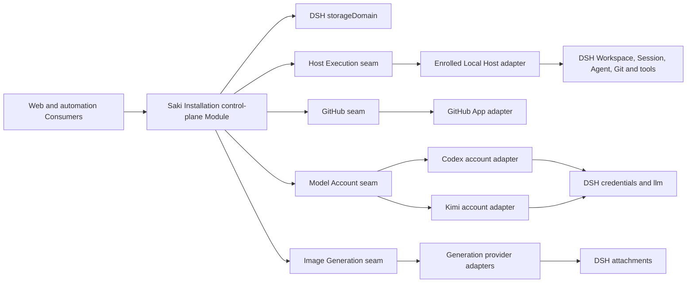

# Saki 0.1.0 backend architecture

English | [中文](0.1.0-backend.zh.md)

This reference defines the initial backend Modules, Interfaces, persistent ownership, and failure semantics for the [version 0.1.0 specification](../versions/0.1.0.md). Product meaning remains in the [domain contexts](../../agents/domain.md); architectural rationale remains in [ADR 0004](../../adr/0004-control-and-execution-planes.md), [ADR 0005](../../adr/0005-recoverable-control-intents.md), [ADR 0006](../../adr/0006-modular-control-plane-and-four-capability-seams.md), [ADR 0007](../../adr/0007-single-control-plane-and-enrolled-hosts.md), [ADR 0008](../../adr/0008-principals-grants-and-actor-attribution.md), [ADR 0009](../../adr/0009-durable-dispatch-intervention-and-attention-projections.md), [ADR 0010](../../adr/0010-fenced-idempotent-dispatch-admission.md), [ADR 0011](../../adr/0011-dpapi-local-user-trust-credentials.md), [ADR 0012](../../adr/0012-forward-migrations-and-installation-maintenance.md), [ADR 0013](../../adr/0013-polling-first-staged-github-synchronization.md), [ADR 0014](../../adr/0014-stable-resource-bindings-over-canonical-worktrees.md), and [ADR 0015](../../adr/0015-reserved-automation-budgets-and-usage-ledger.md).

## Runtime structure

Saki is one Cordis plugin composition and one process in version 0.1.0. That process runs the one active control plane for a stable Saki Installation and an independently identified, enrolled Local Host. The planes are logically separate, but no network transport sits between them. A later remote Host implements the Host Execution seam rather than moving Work Item, policy, routing, or recovery rules out of the control plane. Migrating the Installation requires the prior writer to quiesce; active-active control planes are unsupported.



## Package topology

Saki packages use the `@breakfastdapaidang/saki-*` namespace and remain private in version 0.1.0. The repository's existing `packages/*/*` workspace pattern already includes `packages/saki/*`; package-governance and release checks must classify the second namespace explicitly before implementation starts. The generic DPAPI credential Provider is the one planned addition under an existing DSH package group rather than `packages/saki/`.

| Path | Module role |
| --- | --- |
| `packages/credentials/credentials-windows-dpapi` | Generic Windows DPAPI Service Provider for `ctx.credentials` |
| `packages/saki/control-plane` | Deep product Module: Control Intent lifecycle, record ownership, authorization, policy, recovery, and Projections |
| `packages/saki/execution` | Host Execution Service Definition |
| `packages/saki/execution-local` | Local Host Provider over DSH runtime and system Git |
| `packages/saki/github` | GitHub Service Definition with platform-level facts and mutations |
| `packages/saki/github-app` | GitHub App Provider and polling or webhook normalization |
| `packages/saki/model-account` | Model Account Service Definition and provider registry |
| `packages/saki/model-account-codex` | Codex authorization, usage, capability, and LLM-route Provider |
| `packages/saki/model-account-kimi` | Kimi authorization, usage, capability, and LLM-route Provider |
| `packages/saki/generation` | Image Generation Service Definition |
| `packages/saki/generation-<provider>` | First verified generation Provider; the protocol research decides its concrete name |
| `packages/saki/automation` | Consumer and internal budget service that evaluates Automation Policy, reserves resources, settles usage, and submits Control Intents |
| `packages/saki/installation-maintenance` | Installation lease, manifest selection, local Recovery Backup, exact retained-state upgrade, and crash recovery orchestration |
| `packages/saki/host-api` | Host-side typed transport that exposes only the control-plane Interface |
| `packages/saki/web-ui` | Client Consumers and Projection rendering |
| `packages/saki/bundle` | Saki profile composition and default plugin wiring |

The control-plane package keeps `work-management`, `agent-operations`, `model-supply`, and `recovery` as private source modules. They own distinct terms and records but do not expose repositories or managers as public Interfaces. A context becomes its own package only after it has an independent Consumer, deployment, security lifecycle, or release cadence.

## Control-plane Interfaces

The control-plane Module exposes product operations and local access through two interfaces. Closed Intent and Query maps preserve typed payloads and results without exporting storage tables, while the access interface keeps bootstrap and Browser Session lifecycle out of product authority.

```text
SakiAccess
  readAccess(presentedSession?, signal) -> AccessProjection
  exchangeBootstrap(transportContext, request, signal) -> AccessExchangeResult
  logoutCurrentSession(authentication, requestToken, signal) -> AccessLogoutResult

SakiControlPlane
  submit(authentication, intent, signal) -> IntentReceipt
  query(authentication, query, signal) -> typed Projection
  onChanged(listener) -> disposer
```

`presentedSession` is an untrusted credential extracted by Host API from the HTTP cookie, while `transportContext` is trusted connection and Origin metadata; neither is a field in browser JSON. `saki-host-api` uses a package-private `SakiAccess.resolveAuthentication(presentedSession, transportContext, requestToken?)` helper to validate the raw cookie by digest, generation, lifecycle, Origin, and request token as applicable and construct `AuthenticationContext`. That helper is available only to the trusted Consumer, is not a wire method, and never returns authentication context or raw cookie material to the browser.

`submit` receives that trusted authentication context from its Consumer. On every call it revalidates an active Browser Session in the active Installation State Generation, an active Principal, and current Grant revisions and resource scope; it then evaluates Automation Policy, derives the Actor, and validates the complete Intent before any reservation or external call. Principal, authentication-context, Actor, Browser Session, and Grant authority fields in an untrusted request are rejected rather than ignored or trusted. It persists an accepted Intent, applies expected-revision checks, atomically creates or reuses required budget reservations and single-record admission claims, and dispatches external work. Reusing one Intent id with identical content returns its existing receipt; reusing it with different content rejects.

`query` performs the same Browser Session, Installation generation, Principal lifecycle, current Grant revision, and resource-scope validation before returning detached product Projections such as My Work with control-plane-derived Action Offers, Project summaries, Development Workspace, Work Item, Milestone and Release, Work Session, Agent Run, Execution Trace, Project configuration, Model Supply, Generation Job, and Attention Inbox. It never returns a KV handle, mutable domain entity, live DSH Agent, Host path required for later calls, credential value, or provider-specific response. An Action Offer reflects current eligibility but grants no authority; `submit` re-evaluates its expected revision, Grant, and operation conditions.

`SakiAccess.readAccess` is the only read admitted without a valid Browser Session. Its unauthenticated form contains only a closed required-action state and generic retry guidance; it omits Installation, challenge, Principal, Grant, Host, Project, and resource identifiers and does not distinguish unknown, expired, consumed, or revoked secrets. Its authenticated form contains display-safe Principal and Browser Session facts plus a request token derived from the presented raw session cookie, but never cookie material, a verifier secret, or Grant records. `exchangeBootstrap` and `logoutCurrentSession` are the only product mutations that do not enter through a Control Intent: they mutate only the Installation Access aggregate under the authentication protocol and cannot reach Project, Host, provider, or external-effect state.

Milestone and Release projects GitHub Milestone scope together with the versioned Saki phase, exact `saki-v*` tag, recursively peeled Release Commit, included official Upstream Baseline, embedded Release Evidence, PR and CI evidence, observation state, and repair or reconciliation state. Execution Trace returns bounded references across the existing Actor, Intent, Dispatch, Host Operation, Execution, Session, Run, Intervention, usage, and Outcome Evidence records rather than creating another event log. Project configuration combines the current binding and GitHub mapping revisions, default Agent Profile, Automation Policy, typed budgets, automatic-Done evidence rules, synchronization policy, effective validation, and repair state for one selected Project.

Project-configuration Intents carry the expected configuration revision and update only the default Agent Profile, Automation Policy, typed budgets, automatic-Done evidence rules, or synchronization policy. The control plane verifies that the referenced Agent Profile exists, every enabled automatic action remains within the Project Automation Principal's Grants, required typed budgets are finite, automatic-Done rules name supported Outcome Evidence, and synchronization changes have a valid GitHub mapping. Resource Binding and GitHub mapping remain read-only references here and change only through their dedicated registration, rebind, or mapping-repair Intents. A synchronization change remains unavailable for mutation until revalidation and a complete scan publish a new checkpoint; saving the configuration alone never proves that automation is active.

`onChanged` is a contained post-commit invalidation notification. The listener receives affected Projection keys and re-queries; it does not fold deltas, authorize work, or treat notification delivery as durable evidence. Principal lifecycle or Grant revision and scope changes invalidate every affected Principal-scoped Projection before another read is served.

### Persistent ownership

| Record | Authoritative Saki facts |
| --- | --- |
| Saki Installation | Stable Installation identity, product namespace, active-writer mode, active Installation State Generation, data-format revision, and creator-build provenance |
| Saki Host | Stable Host identity, enrollment and trust state, revalidated capability inventory, and last observation |
| Installation Access | One aggregate owner record containing distinct branded, revisioned Bootstrap Challenge and Browser Session entries; generation and Principal bindings; one-way bootstrap and cookie-token digests; non-secret request-token derivation version and domain metadata; issue and expiry times; monotonic lifecycle states; and cleanup metadata |
| Principal | Stable security identity, kind, lifecycle, and external identity bindings |
| Grant | Issuer, subject Principal, allowed actions, resource scope, validity, delegation limit, parent, revision, and revocation |
| Development Project | Stable identity, DSH Workspace and Resource Binding references, GitHub binding, defaults, and configuration revision |
| Resource Binding | Stable binding identity, owning Host, revisioned Workspace and worktree observation, health, rebind evidence, and retirement state |
| Work Item control | GitHub reference and observed revision, Work Assignment, Work Session relationships, primary Session, and claim source |
| Work Session | Stable collaboration identity, Work Item association, DSH Session associations, participants, and primary-history facts |
| Agent Run | Lifecycle, trigger, actual Agent Profile version, resolved Model Route, Host Operation reference, evidence, and outcome |
| Automation Policy | Versioned admission, delivery, evidence, budget, and automatic-Done rules |
| Automation Budget Reservation | Policy revision, Actor, Intent or operation, scopes, reserved dimensions, expiry, lifecycle, and settlement references |
| Usage Ledger Entry | Attributed measured, estimated, corrected, released, or unresolved usage with evidence source and observation time |
| Control Intent | Immutable Actor and Grant revisions, requested action, idempotency identity, lifecycle phase, external references, error, and reconciliation state |
| Execution Dispatch | Intended Execution and Host, Work Session and Profile references, payload digest, delivery state, claim id, executor, expiry, revision and fencing token, attempt metadata, accepted operation reference, and reconciliation state |
| Host Operation | Host-owned idempotency mapping from an immutable operation source to one request, preparation, lifecycle, inspection state, effect evidence, and cancellation outcome; dispatch and fencing fields apply only to dispatch-sourced operations |
| Execution Lease | Resource Binding holder, proposed Run and Intent, acquisition revision, and release state |
| Intervention Request | Kind, subject, target, requested response, blocking scope, causal references, deadline and escalation policy, revision, and resolution |
| Provider Account Profile | Provider identity, credential references, Credential Protection Level observations, account metadata, activation state, and latest Usage Snapshot |
| Context Policy | Versioned measurement, compaction, pruning, restoration, and observability configuration |
| Generation Job | Route, prompt and input references, queue state, provider attempt, outputs, provenance, and cancellation |
| GitHub Sync Checkpoint | Installation, Project, Repository and mapping revisions, complete-scan generation and time, confirmed remote fingerprints, mapping health, and rate-limit or failure observation |
| Milestone Delivery | GitHub Milestone identity, metadata revision, Saki-owned delivery phase, expected release tag, repair or reconciliation state, and optional immutable Release Evidence containing the exact tag and Release identity, recursively peeled Release Commit, exact official Upstream Baseline, ancestry verification, PR and CI evidence, Actor, and finalizing Intent |

GitHub owns Work Item Status and manual order; local Git owns repository state; DSH Session events own model-visible history. Saki records references, observations, and recovery metadata without becoming a second authority for those facts.

### Recovery order

Startup opens and validates the Saki domain before automation starts. It confirms the Installation identity and enrolled Local Host, reconciles only Bootstrap Challenge and Browser Session entries already expired by the server clock, rejects sessions from another Installation State Generation or an inactive Principal, revalidates the Host capability inventory and Resource Bindings, loads current Grant revisions, describes every managed credential and activates only Provider Account Profiles whose effective protection satisfies policy, inspects non-terminal external operations, cross-validates every running Agent Run against its exact succeeded `StartAgentRun` Host Operation and request, restores the corresponding live Agent handle only when the matching physical Session header and original input remain present, reconciles non-terminal Control Intents and Execution Dispatches, validates occupied Execution Leases, recovers unsettled budget reservations, restores open Intervention Requests, completes required GitHub scans, and only then publishes readiness and admits automatic work. Startup resume adds no input or wake and issues no model request; a mismatch or unavailable live dependency keeps startup unready. Restart never shortens an otherwise active Browser Session. Manual reads remain available while recoverable items are pending, but a binding with uncertain write ownership, an unknown external charge, or an invalid GitHub mapping stays unavailable for the affected automatic operation.

No external call runs inside a `storageDomain` update callback. Each hard admission invariant has one owning record; other records converge through the Intent lifecycle. Per-Project in-process serialization reduces contention but is not a durability or multi-process lock.

## Data evolution and Installation maintenance

The bundle configures JSON as the default `storageDomain` backend and routes only Saki product-state domains to one dedicated SQLite generation; Session event logs use the separate JSONL persistence provider. Unrelated DSH domains do not share the Saki Installation State Generation lifecycle. State-format capability is independent of build provenance: exact B03 v2 contains `saki_control_plane@2` without a seal; retained v3 and v4 pair their control-plane versions with `saki_storage_generation@1` and `@2`; retained v5 and v6 contain `saki_host_execution@1` beside their control-plane versions and `saki_storage_generation@3` or `@4`; current v7 contains `saki_control_plane@7`, `saki_host_execution@2`, and `saki_storage_generation@5`. The generic `storage-domain` runner validates contiguous `N -> N+1` declarations, exact source and target records, and committed readback without emitting active-domain change events. Determinism and absence of external effects remain obligations of the registering caller: a synchronous callback receives only a detached frozen snapshot, but runtime validation cannot detect ambient dependencies. Domains without a complete chain preserve fail-loud version mismatch; downgrades and state versions unsupported by the running capability reject.

The retained v4 source pack freezes its exact historical ids, limits, grammars, schemas, fingerprints, and helpers. The adjacent v5 domain also freezes its GitHub synchronization input before the v5-to-v6 step adds Work Item records and recovery metadata. The v6-to-v7 step adds manual-Agent records, default Agent Profile references, and the Give-to-Agent Grant action; Host v1-to-v2 adds `StartAgentRun` while preserving retained Git operation requests and evidence. Mutable current schemas validate only migrated v7 output, so later product evolution cannot silently narrow a retained input language.

The B03 Host predates the Installation lease and must be stopped and kept offline manually for the transition. Beginning with B18, the Host and every maintenance command share a no-wait Installation lease backed by a separate SQLite exclusive transaction. A bounded canonical Installation manifest selects the only active and writable Installation State Generation and refers to exact generation metadata by length and digest. Without a manifest, source selection recognizes only the configured B03 database or fresh state; it never scans generation names, journals, backup timestamps, or recency. Invalid selected state or unexplained residue enters maintenance recovery rather than choosing another copy.

Before artifact effects, an upgrade journal fixes the source state version, storage-generation identity, and build provenance together with the backup and candidate identities. Upgrade creates and verifies the exact Recovery Backup, migrates a fresh v7 candidate database, opens it with current declarations, validates all three current domains, the storage-generation seal, and product relationships, proves the source artifacts unchanged, and atomically publishes a `ready` manifest. A crash before publication retains the selected v2 through v6 authority; a crash after publication reopens v7. Recovery compares the backup with the journal-bound source identity before cleaning either a committed or uncommitted operation. Fresh state instead publishes a v7 `provisioning` manifest before current-domain creation and promotes that exact generation to `ready` after validation.

`saki-installation-maintenance` exposes offline `backup`, explicit `verify`, and exact v2-through-v6-to-v7 `upgrade` through the CLI and PowerShell 7 wrapper. Recovery Backup verification resolves the recorded state version through the reader's capability; source build identity is provenance only. Recovery Backups are exact local rollback artifacts, not portable archives, and the package exposes no restore command.

Encrypted Installation Export, replacement-Host restore, and retention remain separate 0.1.0 portability work. The export design includes allowlisted Saki records, integrity metadata, and linked DSH Session exports while excluding plaintext credentials, DPAPI ciphertext, caches, live process state, worktree contents, and absolute paths as reusable authority. Replacement restore retains the Installation id, creates a new Host id, marks Resource Bindings `needs-rebind`, disables Host-bound Provider Account Profiles pending reauthorization or private-material import, requires unresolved Host Operations and Execution Dispatches to reconcile, and keeps automation disabled through recovery. The source Host must remain retired or offline because 0.1.0 has no external coordinator that fences deliberately started historical copies. The state-safety mechanism and crash semantics live in the [manifest-selected Installation-maintenance decision](../../../.agents/notes/implemented/architecture/2026-08-26-saki-manifest-selected-installation-maintenance.md); portable export and restore remain in the [active proposal](../../../.agents/notes/proposed/architecture/2026-08-18-saki-forward-migrations-and-installation-maintenance.md).

## Durable dispatch and intervention

Direct structured Git uses source-general Host Operations owned by Control Intents. Manual Give-to-Agent adds an `execution-dispatch` source and `StartAgentRun` request to that lifecycle. Its short Dispatch Claim fences delivery, while the shared Binding Write Admission's long-lived `agent-run` variant is the sole writable owner and names the origin Intent plus Agent Run rather than a Dispatch. Before durable acceptance, the manual path requires the current LLM adapter to resolve the Agent Profile's exact provider/model route; failure returns `model-route-unavailable` without retaining Agent operation records or starting generation. Resolution proves a registered provider adapter and exact model metadata, not production provider authorization, credential availability, quota, or account health. Broader automatic delivery, Intervention Request, and Attention Inbox behavior retains the separate records described below. The [manual dispatch decision](../../../.agents/notes/implemented/feature/2026-08-18-saki-manual-give-to-agent-dispatch.md) owns the implemented recovery ordering.

An accepted Control Intent that creates or resumes an Execution first persists an Execution Dispatch. Host wake-up is a disposable delivery mechanism: startup recovery or a future transport may offer the same dispatch again. The Dispatch record owns its intended Execution and delivery state, while the Intent owns authorization, attribution, and the requested product change.

### Dispatch lifecycle

| State | Meaning |
| --- | --- |
| `pending` | No Host Operation has been accepted; the record becomes claimable at `nextAttemptAt`. |
| `claimed` | One unexpired Dispatch Claim may prepare Host admission. |
| `accepted` | The Host Operation mapping and control-plane receipt are durable; delivery is complete, not the Execution. |
| `canceled` | A Control Intent canceled delivery before acceptance. |
| `rejected` | The Host definitively refused admission; correction requires a new Intent and dispatch. |
| `reconciliation_required` | Automatic delivery stopped because the result, absence, or remaining retry authority cannot be proved. |

`accepted`, `canceled`, and `rejected` are delivery-terminal. An attributed reconciliation Intent may resolve `reconciliation_required` to one of those states or to `pending` only when recorded evidence makes another attempt safe.

### Claim and Host admission

The durable scanner claims an eligible `pending` dispatch or replaces an expired `claimed` record with an expected-revision compare-and-set. A new claim records its executor, claim id, issuance and expiry, increments the monotonic fencing token, and changes or retains the state as `claimed`. The same executor may renew an unexpired claim using the expected revision without changing the token; an expired claim can only be reacquired with a higher token. Claim time and validity come from the control plane.

The claimant calls `prepareOperation` with the stable `execution-dispatch` source, intended Agent Run, immutable payload digest, and current claim. The Host validates that claim with the control plane and atomically creates or returns one Host Operation keyed by dispatch id before invoking DSH or another external capability. Exact replay or a later valid claim returns the same reference and records the latest prepared token; changed immutable input is a conflict. After all awaited Host work, the final Dispatch update compare-and-sets the exact same unexpired claim, revalidates cancellation, Grants, Automation Policy, Host capability, and any required Execution Lease, persists the operation reference, and moves the dispatch to `accepted`.

Only `startOperation` may begin or resume the prepared Host Operation, and it first validates the accepted dispatch, operation reference, fencing token, current cancellation state, and capability-boundary authority. Start is idempotent by operation reference. A preparation whose acceptance failed remains inert. Claim expiry invalidates the old claimant but does not cancel an accepted operation, stop its Execution, or release its Execution Lease. The complete rationale and failure ordering are in [ADR 0010](../../adr/0010-fenced-idempotent-dispatch-admission.md).

Persisted `attemptCount`, `nextAttemptAt`, and `lastError` drive configurable retry backoff; process-local notifications only wake the scanner. A confirmed pre-preparation transient failure may release the claim and return the same dispatch to `pending`. After any missing acknowledgement, recovery inspects by dispatch id before retrying. Confirmed absence permits reacquisition after expiry; unknown or conflicting evidence and exhausted retry budget stop in `reconciliation_required` and create an Intervention Request when an operator must decide. Cancellation before acceptance moves the dispatch to `canceled`; cancellation after acceptance preserves `accepted` and controls the Host Operation or Execution through another Intent.

### Intervention and attention

An Intervention Request persists input, approval, credential authorization, acceptance, conflict-resolution, or reconciliation work independently of a live Agent turn. A response is submitted as a new Control Intent and must target the request's expected revision. The first authorized response wins, notification acknowledgement remains separate, and expiration never grants approval. Model-visible responses enter the Work Session as attributable reconstructable events or durable references.

Attention Inbox is a Projection over open Work Assignments, Intervention Requests, failed or ambiguous Dispatches, and selected Signals for the authenticated Principal. It owns no queue rows. The Work Management `Inbox` remains the status for unevaluated Work Items and is not this Projection.

## Shared external-effect rules

The four capability seams do not implement one universal adapter base. They share the following obligations while retaining capability-specific methods:

- Every mutation carries a Control Intent id and required cancellation signal for the current attempt.
- Every dispatch carries immutable Actor attribution and only the delegated authority needed by that operation; the external credential identity is recorded separately from the Saki Actor.
- Host preparation returns a stable operation or natural-resource reference before the control plane accepts delivery and before the Host begins an external effect.
- Re-dispatch is either idempotent or forbidden until inspection establishes the prior outcome.
- Inspection distinguishes pending, succeeded, failed, canceled, and unknown outcome; unknown never means failed.
- Provider notifications are hints to inspect or refresh. Only a confirmed read or mutation result updates an authoritative Projection.
- Errors use provider-neutral categories for invalid input, conflict, denial, unavailable dependency, rate limiting, unsupported capability, cancellation, and unknown outcome while retaining provider evidence.
- Adapters resolve credential references and effective Credential Protection Levels per operation through a capability Provider on the target Host, enforce the operation's required level, and never return secret values. Control-plane records retain opaque references and safe observations only.

## Host Execution seam

Host Execution isolates machine-local resources and is the future remote-Host seam. Every Resource Binding names its owning Host, and the control plane addresses that binding rather than an implicit local machine or global absolute path. The Local Host adapter resolves the DSH Workspace path, Agent and Session handles, filesystem, tools, and system Git internally.

```text
HostExecution
  inspectProjectSelection(request, signal) -> InspectProjectSelectionResult
  inspectProject(request, signal) -> InspectProjectResult
  readDiff(binding, request, signal) -> ReadProjectDiffResult
  prepareOperation(request, admissionSource, signal) -> HostOperationReceipt
  startOperation(operation, acceptance, signal) -> HostOperationStartResult
  resumeAgentRun(operation, request, signal) -> void
  inspectOperation(operation, signal) -> HostOperationSnapshot
  cancelOperation(operation, reason, signal) -> HostOperationSnapshot
  onChanged(listener) -> disposer
```

`prepareOperation` returns a closed receipt: `source-conflict` and `unavailable` failures carry no acceptance, while success carries durable preparation and snapshot plus a Provider-owned same-process acceptance. Both arms of the bounded `HostOperationStartResult` carry the current snapshot. `inspectOperation` and `cancelOperation` reject an unknown operation reference; every successful call returns an authoritative snapshot, and neither uses `undefined` for absence.

`resumeAgentRun` is startup-only and accepts only a control-plane-validated running Run's exact succeeded `StartAgentRun` operation and request. It restores the live Agent handle against the same physical Session, frozen header, and original input without adding an input or wake or issuing a model request. A non-succeeded or mismatched operation, missing or conflicting Session evidence, or unavailable or conflicting live Agent keeps startup unready.

Project-selection inspection remains read-only. Its request contains one selected Saki Host id and an untrusted directory locator. A Provider resolves the locator independently on every call and returns a browser-safe `ProjectSelectionProjection` beside a trusted Host observation from the same inspection. Inspection never creates a Workspace or Resource Binding. Bound-project status, bounded Diff, the source-general Host Operation lifecycle, and manual Agent start are implemented; worktree creation, rebind, repair, retirement, and automated dispatch remain separate Consumers.

`ProjectSelectionProjection` reports a sanitized display location, branch, HEAD, upstream, safe remotes, an optional existing Workspace id, bounded inherited-change evidence, automatic-mutation eligibility, and blocking reasons. Its companion trusted observation retains canonical worktree, per-worktree Git-directory, common Git-directory, and comparison facts only for the Host and control plane. Neither value carries repository-sized diff text.

`project-changes` reopens the exact active Resource Binding and returns a complete status observation containing the Binding revision, HEAD, branch and upstream, exact index-tree evidence, worktree fingerprint, structured rows, repository-level write eligibility, and one status fingerprint. Rows expose bounded repository-relative display paths plus opaque observation-scoped ids and fingerprints; file selections inside mutation Intents carry only the ids and fingerprints, while canonical Host paths remain private. `project-diff` resolves one such id, layer, and cursor against the exact status fingerprint and returns a bounded page tied to a complete patch fingerprint; stale, ambiguous, binary, untracked, malformed, or over-limit results fail closed.

Direct `StageFiles`, `UnstageFiles`, and `CreateCommit` Intents freeze the authenticated Actor, authority, Registry and Project revisions, complete Git preconditions, and selected ids or message. One Binding Write Admission per Resource Binding is `available` or reserves one `manual-host-operation` or `agent-run` in `reserved` or `accepted` phase. Direct Git durably reserves the manual variant, prepares one `{ kind: 'control-intent' }` Host Operation, accepts that exact preparation, and starts it outside storage callbacks. Manual Agent start contends on the same row and retains the `agent-run` variant after the Run is confirmed. Exact replay returns the same operation; different immutable input conflicts; missing or contradictory effect evidence enters reconciliation required. The [implemented structured-Git decision](../../../.agents/notes/implemented/architecture/2026-08-28-saki-recoverable-structured-git-operations.md) owns the direct Git lifecycle.

Every recovered effect plan must carry an `indexReadLimit`, and Commit plans must also carry a `reflogReadLimit`. Durable validation keeps both within Buffer-safe configuration domains and requires the index limit to retain every expected index, target index, and pin already recorded in the plan. Resume, inspection, cancellation, blocking-lock removal, and terminal cleanup use these frozen plan values rather than current Local Host configuration. Provider-private index plans otherwise fail closed before path decoding or Git use: raw validation rejects an empty or over-limit change list and aggregate UTF-8 or canonical Base64 decoded-path overflow before structural element parsing or Base64 allocation, while the element schema admits only bounded repository-relative paths. The `update-index --index-info` stdin allowance combines the inventory aggregate path-byte allowance with one object-format-specific fixed record allowance per selected change and saturates at Node's Buffer limit. Stage reads symbolic links without following them, hashes exact target bytes, treats Node filesystem failures as retryable, and checks cancellation again after `readlink` and before `hash-object`.

Stage and unstage produce and verify a target alternate index; Commit creates a deterministic hook-free unsigned object from the exact observed index tree. Before any mutation creates a real `index.lock`, its durable `not-started` plan records a complete random operation-owned pin beside the bound index: index operations pin target index bytes, while Commit pins its exact lock marker. On POSIX, an index pin preserves the existing index permission bits or records the actual Git-style mode created for a missing index. On Windows, publication of an existing index copies its DACL onto the still-empty pin before writing target bytes. Before plan persistence, the Local Host synchronizes every private file and pin, synchronizes `objects/info`, every populated loose-object fanout, `objects`, the payload, the scratch wrapper, and the operating-system temporary parent in bottom-up order on POSIX, and revalidates the scratch identities. A bounded private manifest records newly materialized loose objects, while the Commit plan separately retains its exact candidate commit and root tree.

An attempt acquires `index.lock` as a no-clobber hard link from the pin, proves that both names still identify the recorded file, and then re-reads the complete expected-index evidence, including mode. It publishes an existing index by same-directory rename on POSIX or `ReplaceFileW` on Windows, and publishes a missing index through a create-only hard link from the owned lock. Every path synchronizes the index directory before success can be recorded; Windows cannot claim POSIX directory-`fsync` durability.

Commit reads identity only from worktree-local or repository-local configuration with includes disabled, supplies the frozen timestamp and timezone to `git var GIT_AUTHOR_IDENT`, and persists the Git-canonical name and email as both author and committer. Missing or invalid canonical identity fails before plan persistence. Every structured mutation fixes `core.fsyncMethod=fsync` and `core.fsync=loose-object,index,reference` for its Git plumbing. Before `attempting` is persisted, Stage synchronizes the exact currently loose source objects returned by its selected hashes, while Commit reconstructs its source candidate and synchronizes the exact candidate commit and root tree plus every private-manifest object currently loose in the source; source-existing nested subtrees remain prior repository authority. An object absent from the loose namespace is treated as already packed without a per-object Git probe. Attached-HEAD planning freezes the target branch; the Host revalidates HEAD immediately before the effect and compare-and-sets only that frozen ref, so a concurrent later checkout cannot redirect publication. After `update-ref`, the Host synchronizes the stable target reflog file and the target ref and reflog parent-directory chains through the common Git directory; recovery repeats the barrier. The current target proves success without parsing an oversized reflog. After later external ref progress, the exact transition proves success only when it is read from the same stable reflog within the frozen `reflogReadLimit`; oversized or changing attempted history enters `effect-unknown` reconciliation. The limit bounds parsing rather than file synchronization. Detached HEAD remains available to read, Diff, stage, and unstage, but CreateCommit is unavailable because Git 2.45 cannot atomically prove that `HEAD` stayed direct while compare-and-setting its object id.

The scratch plan records the creation identities of the outer directory, payload directory, and exclusive owner marker. Before every Node or Git handoff of a scratch-derived hooks directory, object directory, or private index, the Local Host revalidates all three identities and derives the child path from the verified payload. Commit repeats the check after `attempting` is durable and immediately before `update-ref`; a mismatch remains monotonic attempted evidence and enters reconciliation. Cleanup quarantines an exact wrapper-and-marker match, promotes the marker to an external witness, and removes the payload through an identity-revalidated no-follow walk: real directories are revalidated after enumeration, before every child, and before removal, while files, symbolic links, and Windows junctions are unlinked without following their targets. A foreign or unavailable replacement aborts cleanup and best-effort restores the recorded wrapper; failed restoration preserves the quarantine and witness for terminal replay. Portable Node path APIs do not provide cross-platform handle-relative path use or removal, so a same-user process that can modify the private directory may still replace a pathname between validation and the next filesystem call.

A planned mutation removes or proves absence of its blocking lock and synchronizes the index directory before persisting a semantic terminal or reconciliation state; terminal replay retries exact-owner cleanup of the nonblocking pin and scratch directory, including partial quarantine cleanup. Durable `not-started`, `attempting`, and `applied-recorded` publication evidence distinguishes a proven target from pre-effect failure; an expected value after an attempted effect is ABA-ambiguous and stops for reconciliation. POSIX propagates scratch, source-object, index, ref, and reflog directory-sync failures. Windows still synchronizes writable files and uses Git's configured file synchronization and atomic publication, but cannot claim directory-entry durability across a crash. The Local Host requires Git 2.45 or newer.

### Resource Binding lifecycle

The Resource Binding id is stable and owns Execution Lease exclusivity; its location is a revisioned Host observation. Registration accepts an existing directory only. The Local Host combines DSH's `fs.realpath` Workspace canon with filesystem discovery of the Git top level, per-worktree Git directory, and common Git directory. It validates the selected ordinary, linked or detached, or local separate-Git-directory layout before bounded read-only Git queries run against a private control snapshot. Same-Host candidates collide when either the canonical worktree root or per-worktree Git directory matches; a common Git directory groups related worktrees without collapsing them. Paths are not lowercased because the selected filesystem may be case-sensitive, while a direct reparse locator is rejected rather than treated as another alias.

First registration receives an expected Registry revision and the browser-confirmed inspection fingerprint and inherited-change baseline. The control plane persists the registration Intent before Workspace creation, re-inspects the retained canonical worktree path as an untrusted locator, observes or adopts the exact Workspace identity, and compare-and-sets the Project, Resource Binding, path indexes, and Intent mapping into one Registry revision. Restart and exact Intent replay resume the recorded phase and converge on one receipt and the same Project, Binding, and Workspace identities; changed payloads, stale Registry revisions, and duplicate path identities conflict. The [implemented registration Agent Note](../../../.agents/notes/implemented/architecture/2026-08-20-saki-existing-directory-project-registration.md) owns this bounded lifecycle.

Binding health is `active`, `missing`, `repair-required`, `needs-rebind`, or `retired`. Mutation admission repeats Host inspection and rejects a stale binding revision. `RebindDevelopmentProject` requires every Run, terminal, Dispatch, and Host Operation capable of mutating the old location to reach quiescence. It then selects an existing directory, records old and new evidence under the Host Operator Actor, and advances the Project to a DSH Workspace at the new canonical location. Historical DSH Sessions retain their original Workspace and cwd; continuing a Saki Work Session creates a successor DSH Session rather than rewriting history.

Version 0.1.0 does not physically create, move, repair, remove, or prune worktrees. Retirement disables new execution without deleting local or remote resources. Automatic mode requires a clean worktree. Manual takeover of existing changes records a bounded baseline and inherited-change warning; ambiguous mixtures remain ineligible for automatic staging or completion. [ADR 0014](../../adr/0014-stable-resource-bindings-over-canonical-worktrees.md) defines the complete lifecycle.

## GitHub seam

The GitHub seam exposes platform facts and authorized mutations, not Saki Board rules. The control plane maps GitHub fields to Work Item Status, interprets Milestones and Outcome Evidence, and decides which mutations follow a user or automation Intent.

```text
GitHubCapability
  read(query, signal) -> typed GitHub facts
  scan(request, signal) -> complete GitHubScan
  dispatch(mutation, signal) -> GitHubMutationResult
  inspectMutation(mutation, signal) -> GitHubMutationSnapshot
```

The initial read set covers repositories, Issues, Projects v2 fields and items, Milestones, Git tag references and recursively peeled targets, Releases, Commits and ancestry, PRs, Actions, checks, commit statuses, and installation permission facts. Release evidence uses the `refs/tags/saki-v*` reference and recursively peels any annotated tag until it reaches a Commit; GitHub Release `target_commitish` is not release identity. The mutation set covers creating an Issue, adding an Issue to a Project, changing a field or item position, closing or reopening an Issue, and creating or updating a PR. The adapter returns GitHub node ids, URLs, observed revisions, and rate-limit facts without converting them to Saki statuses.

`CreateWorkItem` persists the title, intended outcome, acceptance criteria, Project id and expected Project revision, and expected GitHub mapping revision before dispatching GitHub work. The confirmed Issue node id is recorded before Saki adds it to the selected Project and writes Inbox. Every confirmed partial fact appears in the Work Item Projection with its recovery action. A lost Issue-creation dispatch result is inspected when the adapter can identify the result; otherwise the Intent becomes reconciliation required and Saki never creates a browser-only card or blindly creates another Issue.

The implemented v6 slice persists one staged Create/Move Intent and one per-Work-Item targeted recovery row before effects. Move can add a missing Project membership, set Status, set an optional API-relative position, and close or reopen the Issue to match terminal status. The Provider never retries internally; after a missing reply, the control plane inspects first and repeats only when the exact pre-effect state is proved. Confirmed targeted observations project immediately over the last complete Board, retain the latest non-terminal Status through terminal moves, and are folded into a later complete scan only when their observation time and Repository, Project, and Status-field identities match. External Issue close or reopen mismatches produce only an attributed move repair; archived items remain Canceled without an impossible reopen repair. This is recoverable orchestration with evidence-driven continuation, not an exactly-once GitHub transaction.

Version 0.1.0 uses configurable polling as the baseline. A scan stages every required Project item and Repository Issue page, validates node-id mappings, and advances the GitHub Sync Checkpoint with one atomic confirmed projection. Page cursors are in-flight pagination state, never durable change offsets. The active Board defaults to 30-second polling and background Projects to five minutes; startup, manual refresh, reconnect, local mutation, and a later webhook wake the same scanner. A webhook never applies state directly.

The Board scan and GitHub Sync Checkpoint remain independent from targeted PR, CI, Milestone, tag, Release, Commit, and ancestry reads. Those facts refresh through configurable polling only while their View is active or a related Intent, Run, delivery, or reconciliation remains pending. Each affected Projection carries its own last-confirmed observation, current failure, staleness, and invalidation state; a failed targeted refresh preserves its prior confirmed facts and never advances the Board checkpoint.

GitHub owns a Milestone's title, description, due date, open or closed state, and Issue scope. A versioned Saki `Milestone Delivery` record owns Planned, In Progress, Ready to Release, or Canceled phase metadata plus optional immutable Release Evidence; phase changes use an expected-revision Control Intent. Released is derived only when that evidence binds the expected exact `saki-v*` tag and GitHub Release to the same recursively peeled Commit. An externally closed Milestone without Canceled metadata or matching release evidence enters repair or reconciliation instead of being classified implicitly.

A Release Intent writes the exact official upstream Commit as Upstream Baseline before finalization. An expected-revision finalization Intent reads that Commit from the configured upstream repository, verifies it is an ancestor of the recursively peeled Release Commit, and atomically embeds immutable Release Evidence with the tag, Release, Commit, baseline, prior Milestone Delivery revision, and supporting evidence in the same Milestone Delivery record. Neither a branch name nor `target_commitish` can substitute for either Commit. External GitHub changes observed during finalization advance the Intent to conflict or reconciliation without publishing a partial phase or evidence mapping.

Each `MoveWorkItem` carries the exact Work Item fingerprint and, when positioned after another card, that predecessor's fingerprint. The control plane resolves membership, Status, Issue open state, and API-position facts for each atomic stage. A targeted pre-read permits idempotent success or the mutation; any mismatch is a visible conflict. The adapter confirms the target after mutation and inspects a missing dispatch result before retry. Recreated or missing fields make writes unavailable until an attributed repair Intent and complete scan succeed. One serialized installation-token queue prioritizes interactive and mutation work, observes GraphQL and REST limits, and pauses background scans before a configurable reserve is exhausted. [ADR 0013](../../adr/0013-polling-first-staged-github-synchronization.md) defines publication, conflict, repair, and rate-limit behavior.

## Automation budgets

Automatic mode uses durable reservations rather than client counters or post-run estimates. The control plane reserves all applicable per-operation, Run, Work Item, Project-window, and Provider Account Profile dimensions before the corresponding effect. Reservations are idempotently keyed to the Control Intent or Host Operation. Actual usage, release, correction, and unresolved amounts append attributed Usage Ledger Entries; a missing response remains reserved until inspection proves usage or absence.

Every enabled 0.1.0 automatic policy sets finite limits for concurrent Agent Runs, Run wall time, model requests, input tokens, output-token allowance, concurrent and total Generation Jobs, generation attempts, GitHub mutations, pushes, and Saki-caused CI triggers. Provider-reported units or currency, allowance windows, and observed GitHub Actions duration remain optional typed dimensions. Actions minutes can pause later work after observation, while push and dispatch counts bound Saki's own trigger attempts before the eventual bill is known.

Each route chooses `pause-on-unknown` or `local-limits-only`. Local-only admission requires every local hard limit and no observed exhaustion or denial; the audit keeps provider-wide quota or monetary cost as unknown. Limit exhaustion blocks new automatic effects, requests deadline cancellation at a safe boundary, and creates an Intervention Request. It never implies Done. A Host Operator may authorize an exact, expiring one-time exception through a new Intent without widening the underlying Grant. [ADR 0015](../../adr/0015-reserved-automation-budgets-and-usage-ledger.md) defines reservation and settlement semantics.

## Model Account seam

Model Account Providers normalize subscription authorization, account inspection, Usage Snapshots, and activation of account-specific routes on the existing DSH LLM seam. The Saki Model Supply module chooses a Provider Account Profile and Model Route; Provider packages do not implement automatic account selection.

```text
ModelAccountProvider
  beginAuthorization(request, signal) -> AuthorizationChallenge
  continueAuthorization(authorization, signal) -> AuthorizationProgress
  inspectProfile(profile, signal) -> ModelAccountSnapshot
  activateProfile(profile, signal) -> ActivatedModelAccount
  revokeProfile(request, signal) -> RevocationResult
```

An authorization challenge normalizes device-code and browser callback flows with an expiry, next-poll time, verification URI, and optional user code. Completion stores tokens through `ctx.credentials`, verifies that the effective resolved result satisfies the required Credential Protection Level, and returns credential references plus provider account identity; it never returns tokens to the control plane or Web client. Cancellation stops local polling but does not claim that a provider-side grant was revoked.

Activation registers or atomically replaces opaque account-specific provider routes through `ctx.llm.registerAdapter`. A Work Session records the selected route, and every Agent Run records the route actually used. Account switching is allowed only at a safe request boundary and never during an active model call.

`ModelAccountSnapshot` separates authentication, health, capability, entitlement, and usage retrieval. Usage state is `available`, `temporarily-unavailable`, or `unsupported`; missing provider data is not presented as zero remaining allowance. Exhaustion blocks new dispatch under policy but does not silently rotate to another profile.

## Image Generation seam

Image Generation Providers perform one provider attempt. The control plane owns durable Generation Jobs, per-account queues, concurrency, retries, attribution, and attachment to Work Items or Work Sessions. The process-local `ctx.jobs` registry may mirror a live attempt for model tools, but it is not the durable job authority.

```text
ImageGeneration
  describeRoute(route, signal) -> GenerationCapabilities
  dispatch(request, signal) -> GenerationAttemptReceipt
  inspectAttempt(attempt, signal) -> GenerationAttemptSnapshot
  cancelAttempt(attempt, reason, signal) -> GenerationAttemptSnapshot
```

A request names the Generation Job and Intent, resolved Model Route, prompt, input Attachment references, requested output constraints, and provenance context. Provider adapters read verified inputs and save completed output bytes through `ctx.attachments` before returning output references. They do not write into a Project worktree; a separate Host `MaterializeArtifact` operation performs that user-visible mutation.

The Saki Generation module admits attempts under a configurable per-account concurrency limit. Queue cancellation is local and immediate; dispatched cancellation follows provider capability and may finish as succeeded if completion won the race. A provider with no status lookup can return unknown after a lost acknowledgement, which remains reconciliation required instead of being billed again automatically.

Image prompts, reference-image inputs, selected outputs, and provenance that reach or return from a model are represented by reconstructable Work Session events or durable references before the UI or another Agent consumes them. A model-facing generation skill is a Consumer of this seam, not the backend itself.

## Reused DSH capabilities

| Need | Existing DSH Interface | Saki use |
| --- | --- | --- |
| Workspace identity and canonical directory | `ctx.workspaceRegistry` | Resource Binding resolution inside Local Host |
| Conversation and model-visible history | `ctx.sessions` and persistence | DSH Session associated with a Work Session |
| Live Agent lifecycle | `ctx.agents` and Agent Presets | Create or resume the execution of an Agent Run |
| Text and tool-call model streaming | `ctx.llm` | Activated account-specific Model Routes |
| Context management | `ctx.compaction` and token measurement | Context Policy Provider selected in Agent composition |
| Secret indirection and protection metadata | `ctx.credentials` plus the Windows DPAPI Provider | OAuth and provider credential references with fail-closed `local-user-trust` policy |
| Durable image bytes | `ctx.attachments` | Generation inputs and content-addressed outputs |
| Live background tool interaction | `ctx.jobs` | Optional mirror of a running generation attempt |
| Development workflow guidance | `ctx.skills` | Pinned Saki Development Skill Pack |
| Files, shell, terminal, sandbox, and tools | Existing DSH seams | Agent and Local Host implementation details |

Saki adds no wrapper when these interfaces already express the required behavior. A generally useful missing capability should be contributed upstream or added as a generic DSH Provider before Saki creates a product-specific substitute.

## Credential protection

The `credentials-windows-dpapi` Provider implements the existing credential Service Definition as a generic DSH package. It stores managed values only as CNG DPAPI `LOCAL=user` ciphertext in a versioned opaque Host-local document and reports a provider-defined `protectionLevel` in both `CredentialInfo` and `ResolvedCredential`. Every typed Provider constructs an explicit level, while parsers validate untyped inputs before constructing a Provider result; no default may label an unknown source as protected.

Saki classifies Codex and Kimi refresh tokens and the Product GitHub App private key as managed high-value references. Authorization, profile activation, and external-effect admission require the effective resolved result to report `local-user-trust`; a missing value, environment, `.env`, plaintext `.credentials.yaml`, classic DPAPI, and machine-scoped CNG DPAPI fail closed. Checking only a prior `describe()` result is insufficient because a concurrent source change could make it disagree with the value used by the operation.

Raw resolution remains inside privileged Host Provider consumers. The control plane and Host read responses receive a safe directory view containing reference, source, protection level, configured state, writability, health, and observation time, without a resolve method. Agent tools, dynamic execution contexts, Session events, Projections, logs, diagnostics, and read responses receive no raw values or ciphertext. The named write-only `credentials.set` request is the sole Host credential transport that carries plaintext, and it never echoes the value. Saki composition separately excludes credential material from crash collection and portable exports. These rules prevent accidental access but do not turn DPAPI into same-user process isolation; `local-user-trust` names that limit.

Portable Installation export excludes the DPAPI document. After Host replacement, the control plane preserves account relationships, marks the profiles unavailable, and opens an Intervention Request for device reauthorization or Host-only private-material import. Organization account sharing requires a separately designed Credential Broker under another OS security identity or an external secret manager; it cannot reuse `local-user-trust` as a multi-user boundary. The detailed implementation and verification obligations live in the [credential Agent Note](../../../.agents/notes/implemented/architecture/2026-08-18-saki-local-user-trust-dpapi-credentials.md).

## Host transport and Web access

`saki-host-api` exposes the three public `SakiAccess` operations and the three `SakiControlPlane` operations through the existing typed Host transport. Before every protected query, submission, or logout, it takes the raw cookie from HTTP transport state, resolves it only through SakiAccess's trusted-Consumer helper, and passes the resulting `AuthenticationContext` explicitly; neither the helper nor authentication context is exposed on the wire. Logout validates the active session and request token without consulting Grant authority. Host API converts other wire identities and validates untrusted payloads before calling either interface. The browser reads Access or protected Projections, performs the bounded bootstrap and logout operations, and submits product Intents only. Provider Interfaces, storage tables, local file access, and credentials are never wire methods.

Version 0.1.0 binds the Web surface to loopback by default and uses a local bootstrap exchange followed by a server-owned Browser Session. This transport fits one Host Operator on the machine running Saki without introducing a durable password verifier, requiring GitHub or another network identity before local recovery is possible, or placing a persistent bearer token in browser storage. A revocable server session also survives an ordinary process restart without making possession of the cookie a Grant. This choice is not a remote-access or multi-user authentication design.

Installation initialization provisions one local human Principal and its Host Operator Grants, then adds a short-lived Bootstrap Challenge entry for that Principal to the single Installation Access aggregate. Challenge and Browser Session ids are distinct branded values and every entry and aggregate carries a revision. The launcher receives the high-entropy clear secret once through its local handoff. Exchange accepts it only in a POST body from the exact configured loopback origin and checks the active Installation generation, active intended Principal, server-clock expiry, digest, and `issued` state without revealing the failure class. One expected-revision `storageDomain` record update atomically changes the challenge from `issued` to terminal `consumed` and inserts exactly one `active` Browser Session entry; only after that commit may the transport emit `Set-Cookie`.

A lost exchange response does not prove whether the cookie reached the browser. The challenge stays consumed and cannot be replayed, while the committed Browser Session remains active until its ordinary expiry or explicit revocation; no retry infers cookie delivery or creates a second session. Challenge states `consumed`, `expired`, and `revoked`, and Browser Session states `expired` and `revoked`, are terminal and monotonic under the server clock. Cleanup may remove retained terminal entries only after the configured security-retention period and never makes an id, digest, or secret reusable. Installation generation replacement terminates prior-generation entries, and Principal retirement makes its sessions inactive even before cleanup. Restart only reconciles entries whose recorded expiry is already past.

A Browser Session entry contains an opaque cookie-token digest rather than the clear token. Its cookie is HttpOnly, SameSite=Strict, scoped to the application path, and Secure whenever the configured origin uses TLS. The record remains valid across restart only for its Installation and active Installation State Generation and ends on expiry, explicit logout, administrative revocation, Principal retirement, or generation replacement. The aggregate persists only a non-secret request-token derivation version and domain. For authenticated Access and every authenticated state-changing request, the server first hashes the raw cookie presented by the browser and constant-time compares it with the stored digest, then uses the selected cryptographic HMAC or KDF with domain separation to derive the request token from that same raw cookie. Access returns the derived token; every mutation requires the exact configured Origin and constant-time compares the header token with a freshly derived value. Bootstrap exchange requires that same exact Origin but has no pre-existing session token. SameSite alone is defense in depth.

The clear bootstrap secret may appear only in the launcher handoff and exact exchange POST body, the raw cookie only in the `Set-Cookie` and Cookie headers and browser's HttpOnly jar, and the derived request token only in authenticated Access and the request-forgery header. Outside those named transports, none enters durable storage, URLs, analytics, logs, diagnostics, traces, Session or domain events, Control Intent or access receipts, snapshots, unrelated wire payloads or Projections, error text, crash artifacts, adapter errors, or Installation Export. No independent request-forgery verifier secret exists or persists. Durable storage contains only bootstrap and cookie-token digests plus non-secret derivation version and domain metadata, so the server can recompute the token from the presented raw cookie after restart. Failure responses do not distinguish an unknown, expired, consumed, revoked, wrong-generation, or wrong-Principal challenge.

A browser is a client of the Installation, not an enrolled Host or an authority source. For every protected `query` and `submit`, the transport resolves an active Browser Session in the active Installation generation and passes trusted authentication context; the control plane then validates Principal lifecycle and current Grant revision and scope. Untrusted Intent wire types contain no Principal, authentication context, Actor, Browser Session, or Grant authority fields, and the decoder rejects reserved fields rather than ignoring them. The control plane derives Actor for each accepted Intent; neither the cookie, bootstrap secret, Access Projection, nor a client-supplied claim can confer authority. Principal or Grant changes invalidate affected Projections immediately. A later GitHub login links an external identity to a human Principal, while organization membership remains input to Grant administration rather than direct Host authority. Multi-user session administration, remote Host authentication, non-loopback deployment, and offline delegation remain outside the release.

Cordis and npm plugins installed into the Host process are privileged trusted code because Cordis lifecycle isolation is not a process sandbox. Dynamic model-generated plugins remain scoped to disposable execution unless the Host Operator reviews and installs them. Repository content, model output, browser payloads, and external events remain untrusted input and must cross validation and policy boundaries even when a trusted plugin handles them.

## Verification

- Contract suites run against each real adapter and a controllable fake through the same Service Definition.
- Control-plane tests use fakes only at the four capability seams and exercise records through `submit`, `query`, and `onChanged`.
- Keyless assembled manual-dispatch tests boot the shipped Saki bundle, real Agent, physical Session persistence, system-owned `development` preset, checkpoint-policy stack, and a controllable fake LLM. They prove the configured provider and model, persona, repository instructions, and `read`, `write`, `edit`, and Windows `pwsh` tool composition.
- Physical and restart assertions pin exact original-input and insertion counts, live-Agent registry membership before replay, restoration of the same Session id, no recovery input, wake, or model request, and fresh writable-Git-world revalidation immediately before original insertion or a pending-input wake.
- Manual dispatch protocol and crash tests reject stale claims, claim expiry during awaited Host work at the final acceptance compare-and-set, changed replay payloads, start-before-acceptance, canceled or replaced inbox input, and conflicting Session evidence; lost acknowledgements are inspected and unknown evidence remains reconciliation required. They cover pre-acceptance cancellation to a canceled Dispatch, post-acceptance cancellation with the accepted receipt and terminal Host snapshot preserved, live-Agent stop and drain before durable child and Intent cancellation and admission release, retry after disposal failure with the handle still tracked, and idempotent restart completion from every terminal multi-record write prefix. Broader automatic dispatch and Intervention Request tests accompany those Consumers.
- Interaction tests keep an Intervention Request answerable across Web reconnect and process restart, reject stale or unauthorized responses, and reconstruct model-visible answers through the Work Session.
- GitHub tests cover complete multi-page publication, removals, incomplete scans, mapping recreation, stale optimistic moves, lost mutation replies, rate-limit reserve, restart, and webhook wake-up without direct state application.
- Implemented Resource Binding registration tests cover direct reparse locators and Git control entries, ordinary, linked, detached, and local separate-Git-directory layouts, missing selections, duplicate canonical observations, dirty evidence, source-control changes, private config precedence, restart, stale Registry revisions, and historical Session preservation. Move detection, rebind quiescence, repair, retirement, and successor-Session tests accompany those later lifecycle Consumers.
- Implemented structured-Git verification covers complete display-safe status, bounded Diff, path-free StageFiles, UnstageFiles, and CreateCommit, deterministic Commit creation with Git-canonical identity, durable publication, restart recovery, and fail-closed reconciliation across Local Host durability barriers; the [structured-Git decision](../../../.agents/notes/implemented/architecture/2026-08-28-saki-recoverable-structured-git-operations.md) owns the detailed boundary and failure-injection evidence.
- Automation tests cover competing reservations, replay, partial settlement, deadline cancellation, stale or absent Usage Snapshots, ambiguous external usage, CI-trigger limits, one-time exceptions, and evidence-gated automatic Done.
- Product-level Web tests boot the real Saki bundle, Host transport, control plane, Local Host adapter, temporary Git repositories, and controllable external Providers.
- Real-provider smokes verify Codex and Kimi device authorization, usage attribution where available, one text Agent Run, image generation and editing, artifact persistence, and bounded concurrency.
- Windows credential tests verify CNG DPAPI `LOCAL=user` ciphertext-at-rest and descriptor authenticity, reject genuine classic and machine-scoped blobs, pin explicit protection metadata and fail-closed source policy, and prove that Host safe-read responses contain neither plaintext nor ciphertext. The write-only `credentials.set` request is tested separately for non-echo behavior; product crash-collection and export tests own their composition exclusions.
- Migration contract tests cover exact retained v2 through v6 acceptance, historical relationship rejection, every adjacent migration through v7, Host v1-to-v2 preservation, chain gaps, invalid output, unsupported stored versions, and downgrade rejection. Current-leaf drift tests replace mutable schemas, limits, and helpers while frozen historical source schemas continue to accept the complete retained table set. Maintenance tests cover all retained upgrade entry points, lease exclusion, Recovery Backup integrity, journal-bound source identity, source immutability, candidate validation, CLI behavior, and crash injection around journal, backup, candidate, invariant, and manifest publication; exactly one manifest-selected generation reopens. Export and replacement-Host restore require their own authenticated-encryption, declared-exclusion, Session-inclusion, and recovery-state evidence when those operations are added.
- Security tests prove each authentication material appears only in its named handoff, cookie, or request-token transport and is absent from durable records, receipts, unrelated Projections and wire payloads, events, snapshots, URLs, analytics, logs, diagnostics, traces, error text, crash artifacts, adapter errors, and exports; unauthenticated Access reads reveal no Installation or security-object identifiers; client-supplied Principal, authentication context, Actor, or Grant fields reject; bootstrap secrets are digest-only, expire, and can create at most one Browser Session; cookie-digest authentication and request-token derivation survive restart without persisting raw cookies, request tokens, or a verifier secret; origin, revocation, generation, and logout rules hold; revoked Grants reject new effects while reconciliation remains possible.

## Reconsideration triggers

A storage system beyond the dedicated `storageDomain` SQLite route requires measured query, transaction, or multi-process needs that its domain and migration facilities cannot meet. An append-only control-plane journal requires audit or temporal-query requirements not satisfied by lifecycle records and external evidence. A private context module becomes a package only when it gains an independent Consumer or lifecycle. Control and execution become network services only when a second Host is a real deployment target with an explicit trust and offline-execution model.
