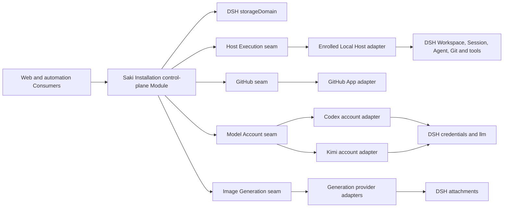

# Saki 0.1.0 backend architecture

English | [中文](0.1.0-backend.zh.md)

This reference defines the initial backend Modules, Interfaces, persistent ownership, and failure semantics for the [version 0.1.0 specification](../versions/0.1.0.md). Product meaning remains in the [domain contexts](../../agents/domain.md); architectural rationale remains in [ADR 0004](../../adr/0004-control-and-execution-planes.md), [ADR 0005](../../adr/0005-recoverable-control-intents.md), [ADR 0006](../../adr/0006-modular-control-plane-and-four-capability-seams.md), [ADR 0007](../../adr/0007-single-control-plane-and-enrolled-hosts.md), [ADR 0008](../../adr/0008-principals-grants-and-actor-attribution.md), [ADR 0009](../../adr/0009-durable-dispatch-intervention-and-attention-projections.md), [ADR 0010](../../adr/0010-fenced-idempotent-dispatch-admission.md), [ADR 0011](../../adr/0011-dpapi-local-user-trust-credentials.md), [ADR 0012](../../adr/0012-forward-migrations-and-installation-maintenance.md), [ADR 0013](../../adr/0013-polling-first-staged-github-synchronization.md), [ADR 0014](../../adr/0014-stable-resource-bindings-over-canonical-worktrees.md), and [ADR 0015](../../adr/0015-reserved-automation-budgets-and-usage-ledger.md).

## Runtime structure

Saki is one Cordis plugin composition and one process in version 0.1.0. That process runs the one active control plane for a stable Saki Installation and an independently identified, enrolled Local Host. The planes are logically separate, but no network transport sits between them. A later remote Host implements the Host Execution seam rather than moving Work Item, policy, routing, or recovery rules out of the control plane. Migrating the Installation requires the prior writer to quiesce; active-active control planes are unsupported.



## Package topology

Saki packages use the `@breakfastdapaidang/saki-*` namespace and remain private in version 0.1.0. The repository's existing `packages/*/*` workspace pattern already includes `packages/saki/*`; package-governance and release checks must classify the second namespace explicitly before implementation starts. The generic DPAPI credential Provider is the one planned addition under an existing DSH package group rather than `packages/saki/`.

| Path | Module role |
| --- | --- |
| `packages/credentials/credentials-windows-dpapi` | Generic Windows DPAPI Service Provider for `ctx.credentials` |
| `packages/saki/control-plane` | Deep product Module: Control Intent lifecycle, record ownership, authorization, policy, recovery, and Projections |
| `packages/saki/execution` | Host Execution Service Definition |
| `packages/saki/execution-local` | Local Host Provider over DSH runtime and system Git |
| `packages/saki/github` | GitHub Service Definition with platform-level facts and mutations |
| `packages/saki/github-app` | GitHub App Provider and polling or webhook normalization |
| `packages/saki/model-account` | Model Account Service Definition and provider registry |
| `packages/saki/model-account-codex` | Codex authorization, usage, capability, and LLM-route Provider |
| `packages/saki/model-account-kimi` | Kimi authorization, usage, capability, and LLM-route Provider |
| `packages/saki/generation` | Image Generation Service Definition |
| `packages/saki/generation-<provider>` | First verified generation Provider; the protocol research decides its concrete name |
| `packages/saki/automation` | Consumer and internal budget service that evaluates Automation Policy, reserves resources, settles usage, and submits Control Intents |
| `packages/saki/installation-maintenance` | Product backup, upgrade, encrypted export, restore, retention, and replacement-Host recovery orchestration |
| `packages/saki/host-api` | Host-side typed transport that exposes only the control-plane Interface |
| `packages/saki/web-ui` | Client Consumers and Projection rendering |
| `packages/saki/bundle` | Saki profile composition and default plugin wiring |

The control-plane package keeps `work-management`, `agent-operations`, `model-supply`, and `recovery` as private source modules. They own distinct terms and records but do not expose repositories or managers as public Interfaces. A context becomes its own package only after it has an independent Consumer, deployment, security lifecycle, or release cadence.

## Control-plane Interface

The control-plane Module has three public operations. A closed Intent map and Query map preserve typed payloads and results without exporting storage tables.

```text
SakiControlPlane
  submit(intent, signal) -> IntentReceipt
  query(query, signal) -> typed Projection
  onChanged(listener) -> disposer
```

`submit` receives trusted authentication context from its Consumer, resolves the Principal, evaluates current Grants and Automation Policy, derives the Actor, and validates the complete Intent before any reservation or external call. Actor and Grant fields in an untrusted request are rejected rather than trusted. It persists an accepted Intent, applies expected-revision checks, atomically creates or reuses required budget reservations and single-record admission claims, and dispatches external work. Reusing one Intent id with identical content returns its existing receipt; reusing it with different content rejects.

`query` returns detached product Projections such as My Work with control-plane-derived Action Offers, Project summaries, Development Workspace, Work Item, Work Session, Agent Run, Model Supply, Generation Job, and Attention Inbox. It never returns a KV handle, mutable domain entity, live DSH Agent, Host path required for later calls, credential value, or provider-specific response. An Action Offer reflects current eligibility but grants no authority; `submit` resolves the current Principal and re-evaluates its expected revision, Grant, and operation conditions.

`onChanged` is a contained post-commit invalidation notification. The listener receives affected Projection keys and re-queries; it does not fold deltas, authorize work, or treat notification delivery as durable evidence.

### Persistent ownership

| Record | Authoritative Saki facts |
| --- | --- |
| Saki Installation | Stable Installation identity, product namespace, active-writer mode, active Installation State Generation, data-format revision, and compatible build identity |
| Saki Host | Stable Host identity, enrollment and trust state, revalidated capability inventory, and last observation |
| Principal | Stable security identity, kind, lifecycle, and external identity bindings |
| Grant | Issuer, subject Principal, allowed actions, resource scope, validity, delegation limit, parent, revision, and revocation |
| Development Project | Stable identity, DSH Workspace and Resource Binding references, GitHub binding, defaults, and configuration revision |
| Resource Binding | Stable binding identity, owning Host, revisioned Workspace and worktree observation, health, rebind evidence, and retirement state |
| Work Item control | GitHub reference and observed revision, Work Assignment, Work Session relationships, primary Session, and claim source |
| Work Session | Stable collaboration identity, Work Item association, DSH Session associations, participants, and primary-history facts |
| Agent Run | Lifecycle, trigger, actual Agent Profile version, resolved Model Route, Host Operation reference, evidence, and outcome |
| Automation Policy | Versioned admission, delivery, evidence, budget, and automatic-Done rules |
| Automation Budget Reservation | Policy revision, Actor, Intent or operation, scopes, reserved dimensions, expiry, lifecycle, and settlement references |
| Usage Ledger Entry | Attributed measured, estimated, corrected, released, or unresolved usage with evidence source and observation time |
| Control Intent | Immutable Actor and Grant revisions, requested action, idempotency identity, lifecycle phase, external references, error, and reconciliation state |
| Execution Dispatch | Intended Execution and Host, Work Session and Profile references, payload digest, delivery state, claim id, executor, expiry, revision and fencing token, attempt metadata, accepted operation reference, and reconciliation state |
| Host Operation | Host-owned dispatch idempotency mapping, immutable input digest, intended Execution, accepted fencing token, operation lifecycle, inspection state, and cancellation outcome |
| Execution Lease | Resource Binding holder, proposed Run and Intent, acquisition revision, and release state |
| Intervention Request | Kind, subject, target, requested response, blocking scope, causal references, deadline and escalation policy, revision, and resolution |
| Provider Account Profile | Provider identity, credential references, Credential Protection Level observations, account metadata, activation state, and latest Usage Snapshot |
| Context Policy | Versioned measurement, compaction, pruning, restoration, and observability configuration |
| Generation Job | Route, prompt and input references, queue state, provider attempt, outputs, provenance, and cancellation |
| GitHub Sync Checkpoint | Installation, Project, Repository and mapping revisions, complete-scan generation and time, confirmed remote fingerprints, mapping health, and rate-limit or failure observation |

GitHub owns Work Item Status and manual order; local Git owns repository state; DSH Session events own model-visible history. Saki records references, observations, and recovery metadata without becoming a second authority for those facts.

### Recovery order

Startup opens and validates the Saki domain before automation starts. It confirms the Installation identity and enrolled Local Host, revalidates the Host capability inventory and Resource Bindings, loads Principals and current Grant revisions, describes every managed credential and activates only Provider Account Profiles whose effective protection satisfies policy, inspects non-terminal external operations, reconciles non-terminal Control Intents and Execution Dispatches, validates occupied Execution Leases, recovers unsettled budget reservations, restores open Intervention Requests, completes required GitHub scans, and only then admits automatic work. Manual reads remain available while recoverable items are pending, but a binding with uncertain write ownership, an unknown external charge, or an invalid GitHub mapping stays unavailable for the affected automatic operation.

No external call runs inside a `storageDomain` update callback. Each hard admission invariant has one owning record; other records converge through the Intent lifecycle. Per-Project in-process serialization reduces contention but is not a durability or multi-process lock.

## Data evolution and Installation maintenance

The Saki control-plane domain uses a dedicated SQLite backend and database through `storageDomain`; unrelated DSH domains do not share its generation lifecycle. Saki-owned persisted schemas register contiguous, deterministic `N -> N+1` migrations with historical input and output validation. The generic migration runner belongs to `storage-domain`, never performs external calls or emits active-domain change events, and preserves the existing fail-loud version mismatch for a domain without a complete chain. Stored versions newer than the current build and downgrade requests reject.

One Installation manifest selects the only active and writable Installation State Generation. Upgrade rejects new mutations, disables automation, drains writes, closes the active domain, creates and verifies an exact Recovery Backup, migrates a fresh candidate database, reopens it with the current spec, validates product invariants, and atomically switches the manifest. Startup selects by manifest rather than filename or recency. A crash before publication keeps the old generation active; a crash after publication reopens the new generation. An invalid selected generation enters maintenance recovery rather than choosing another copy implicitly.

`saki-installation-maintenance` owns `backup`, `verify`, `upgrade`, encrypted `export`, `restore`, and retention orchestration. A Recovery Backup is paired with its compatible build for local rollback. An Installation Export contains allowlisted Saki records, integrity metadata, and linked DSH Session exports through the owning Session export capability. It excludes plaintext credentials, DPAPI ciphertext, caches, live process state, worktree contents, and absolute paths as reusable authority.

Replacement restore builds a candidate without overwriting a running Installation, retains the Installation id, and creates a new Host id. It marks Resource Bindings `needs-rebind`, disables Host-bound Provider Account Profiles pending reauthorization or private-material import, requires unresolved Host Operations and Execution Dispatches to reconcile, and keeps automation disabled through recovery. The source Host must remain retired or offline; version 0.1.0 has no external coordinator that can fence two deliberately started historical copies. PowerShell 7 and the CLI expose maintenance in 0.1.0; Web UI is deferred. The detailed implementation and crash matrix live in the [migration and maintenance Agent Note](../../../.agents/notes/proposed/architecture/2026-08-18-saki-forward-migrations-and-installation-maintenance.md).

## Durable dispatch and intervention

An accepted Control Intent that creates or resumes an Execution first persists an Execution Dispatch. Host wake-up is a disposable delivery mechanism: startup recovery or a future transport may offer the same dispatch again. The Dispatch record owns its intended Execution and delivery state, while the Intent owns authorization, attribution, and the requested product change.

### Dispatch lifecycle

| State | Meaning |
| --- | --- |
| `pending` | No Host Operation has been accepted; the record becomes claimable at `nextAttemptAt`. |
| `claimed` | One unexpired Dispatch Claim may prepare Host admission. |
| `accepted` | The Host Operation mapping and control-plane receipt are durable; delivery is complete, not the Execution. |
| `canceled` | A Control Intent canceled delivery before acceptance. |
| `rejected` | The Host definitively refused admission; correction requires a new Intent and dispatch. |
| `reconciliation_required` | Automatic delivery stopped because the result, absence, or remaining retry authority cannot be proved. |

`accepted`, `canceled`, and `rejected` are delivery-terminal. An attributed reconciliation Intent may resolve `reconciliation_required` to one of those states or to `pending` only when recorded evidence makes another attempt safe.

### Claim and Host admission

The durable scanner claims an eligible `pending` dispatch or replaces an expired `claimed` record with an expected-revision compare-and-set. A new claim records its executor, claim id, issuance and expiry, increments the monotonic fencing token, and changes or retains the state as `claimed`. The same executor may renew an unexpired claim using the expected revision without changing the token; an expired claim can only be reacquired with a higher token. Claim time and validity come from the control plane.

The claimant calls `prepareDispatch` with the stable dispatch id, intended Execution, immutable payload digest, and current claim. The Host validates that claim with the control plane and atomically creates or returns one Host Operation keyed by dispatch id before invoking DSH or another external capability. Exact replay or a later valid claim returns the same reference and records the latest prepared token; changed immutable input is a conflict. The control plane then compare-and-sets the still-current claim, revalidates cancellation, Grants, Automation Policy, Host capability, and any required Execution Lease, persists the operation reference, and moves the dispatch to `accepted`.

Only `startOperation` may begin or resume the prepared Host Operation, and it first validates the accepted dispatch, operation reference, fencing token, current cancellation state, and capability-boundary authority. Start is idempotent by operation reference. A preparation whose acceptance failed remains inert. Claim expiry invalidates the old claimant but does not cancel an accepted operation, stop its Execution, or release its Execution Lease. The complete rationale and failure ordering are in [ADR 0010](../../adr/0010-fenced-idempotent-dispatch-admission.md).

Persisted `attemptCount`, `nextAttemptAt`, and `lastError` drive configurable retry backoff; process-local notifications only wake the scanner. A confirmed pre-preparation transient failure may release the claim and return the same dispatch to `pending`. After any missing acknowledgement, recovery inspects by dispatch id before retrying. Confirmed absence permits reacquisition after expiry; unknown or conflicting evidence and exhausted retry budget stop in `reconciliation_required` and create an Intervention Request when an operator must decide. Cancellation before acceptance moves the dispatch to `canceled`; cancellation after acceptance preserves `accepted` and controls the Host Operation or Execution through another Intent.

### Intervention and attention

An Intervention Request persists input, approval, credential authorization, acceptance, conflict-resolution, or reconciliation work independently of a live Agent turn. A response is submitted as a new Control Intent and must target the request's expected revision. The first authorized response wins, notification acknowledgement remains separate, and expiration never grants approval. Model-visible responses enter the Work Session as attributable reconstructable events or durable references.

Attention Inbox is a Projection over open Work Assignments, Intervention Requests, failed or ambiguous Dispatches, and selected Signals for the authenticated Principal. It owns no queue rows. The Work Management `Inbox` remains the status for unevaluated Work Items and is not this Projection.

## Shared external-effect rules

The four capability seams do not implement one universal adapter base. They share the following obligations while retaining capability-specific methods:

- Every mutation carries a Control Intent id and required cancellation signal for the current attempt.
- Every dispatch carries immutable Actor attribution and only the delegated authority needed by that operation; the external credential identity is recorded separately from the Saki Actor.
- Host preparation returns a stable operation or natural-resource reference before the control plane accepts delivery and before the Host begins an external effect.
- Re-dispatch is either idempotent or forbidden until inspection establishes the prior outcome.
- Inspection distinguishes pending, succeeded, failed, canceled, and unknown outcome; unknown never means failed.
- Provider notifications are hints to inspect or refresh. Only a confirmed read or mutation result updates an authoritative Projection.
- Errors use provider-neutral categories for invalid input, conflict, denial, unavailable dependency, rate limiting, unsupported capability, cancellation, and unknown outcome while retaining provider evidence.
- Adapters resolve credential references and effective Credential Protection Levels per operation through a capability Provider on the target Host, enforce the operation's required level, and never return secret values. Control-plane records retain opaque references and safe observations only.

## Host Execution seam

Host Execution isolates machine-local resources and is the future remote-Host seam. Every Resource Binding names its owning Host, and the control plane addresses that binding rather than an implicit local machine or global absolute path. The Local Host adapter resolves the DSH Workspace path, Agent and Session handles, filesystem, tools, and system Git internally.

```text
HostExecution
  inspectProject(binding, selection, signal) -> HostProjectSnapshot
  readDiff(binding, request, signal) -> DiffPage
  prepareDispatch(request, claim, signal) -> HostOperationReceipt
  startOperation(operation, acceptance, signal) -> HostOperationSnapshot
  inspectOperation(operation, signal) -> HostOperationSnapshot
  cancelOperation(operation, reason, signal) -> HostOperationSnapshot
  onChanged(listener) -> disposer
```

The initial dispatch union contains `StartAgentRun`, `StageFiles`, `UnstageFiles`, `Commit`, `Push`, and `MaterializeArtifact`. `prepareDispatch` persists the idempotency mapping without performing that union member; `startOperation` performs it only after control-plane acceptance. `StartAgentRun` names the Execution Dispatch and current Dispatch Claim, Agent Run, Work Session, Agent Profile version, Model Route reference, limits, Actor attribution, delegated Grant references, and create-or-resume Session disposition; it does not carry a raw working directory or token. A one-off Run has no independent Principal and receives only a parent-subset delegation. `MaterializeArtifact` copies a verified Attachment reference to a Project-relative destination under explicit absent-or-expected-hash preconditions.

Git mutations are structured rather than arbitrary command strings. Commit identifies the expected index tree, and Push identifies the expected commit and target ref, allowing inspection to determine whether a lost acknowledgement already achieved the requested state. Agent cancellation settles the Host Operation only after the DSH Agent handle reaches quiescence; a terminated terminal process is not reported as a recoverable Session.

`HostProjectSnapshot` reports binding health, a display location, worktree identity, branch, HEAD, upstream, staged and unstaged summaries, and unattributed modifications. Diff content is paged and bounded separately so a Project summary never loads repository-sized text.

### Resource Binding lifecycle

The Resource Binding id is stable and owns Execution Lease exclusivity; its location is a revisioned Host observation. Registration accepts an existing directory only. The Local Host combines DSH's `fs.realpath` Workspace canon with Git's absolute top level, per-worktree Git directory, common Git directory, and NUL-delimited porcelain worktree inventory. Same-Host candidates collide when either the canonical worktree root or per-worktree Git directory matches; a common Git directory groups related worktrees without collapsing them. Paths are not lowercased because the selected filesystem may be case-sensitive.

Binding health is `active`, `missing`, `repair-required`, `needs-rebind`, or `retired`. Mutation admission repeats Host inspection and rejects a stale binding revision. `RebindDevelopmentProject` requires every Run, terminal, Dispatch, and Host Operation capable of mutating the old location to reach quiescence. It then selects an existing directory, records old and new evidence under the Host Operator Actor, and advances the Project to a DSH Workspace at the new canonical location. Historical DSH Sessions retain their original Workspace and cwd; continuing a Saki Work Session creates a successor DSH Session rather than rewriting history.

Version 0.1.0 does not physically create, move, repair, remove, or prune worktrees. Retirement disables new execution without deleting local or remote resources. Automatic mode requires a clean worktree. Manual takeover of existing changes records a bounded baseline and inherited-change warning; ambiguous mixtures remain ineligible for automatic staging or completion. [ADR 0014](../../adr/0014-stable-resource-bindings-over-canonical-worktrees.md) defines the complete lifecycle.

## GitHub seam

The GitHub seam exposes platform facts and authorized mutations, not Saki Board rules. The control plane maps GitHub fields to Work Item Status, interprets Milestones and Outcome Evidence, and decides which mutations follow a user or automation Intent.

```text
GitHubCapability
  read(query, signal) -> typed GitHub facts
  scan(request, signal) -> complete GitHubScan
  dispatch(mutation, signal) -> GitHubMutationReceipt
  inspectMutation(mutation, signal) -> GitHubMutationSnapshot
```

The initial read set covers repositories, Issues, Projects v2 fields and items, Milestones, PRs, Actions, checks, commit statuses, and installation permission facts. The mutation set covers adding an Issue to a Project, changing a field or item position, closing or reopening an Issue, and creating or updating a PR. The adapter returns GitHub node ids, URLs, observed revisions, and rate-limit facts without converting them to Saki statuses.

Version 0.1.0 uses configurable polling as the baseline. A scan stages every required Project item and Repository Issue page, validates node-id mappings, and advances the GitHub Sync Checkpoint with one atomic confirmed projection. Page cursors are in-flight pagination state, never durable change offsets. The active Board defaults to 30-second polling and background Projects to five minutes; startup, manual refresh, reconnect, local mutation, and a later webhook wake the same scanner. A webhook never applies state directly.

Every Board mutation carries its expected remote fingerprint for membership, Status, Issue open state, and relevant ordering neighbors. A targeted pre-read permits idempotent success or the mutation; any mismatch is a visible conflict. The adapter confirms the target after mutation and inspects a missing acknowledgement before retry. Recreated or missing fields make writes unavailable until an attributed repair Intent and complete scan succeed. One serialized installation-token queue prioritizes interactive and mutation work, observes GraphQL and REST limits, and pauses background scans before a configurable reserve is exhausted. [ADR 0013](../../adr/0013-polling-first-staged-github-synchronization.md) defines publication, conflict, repair, and rate-limit behavior.

## Automation budgets

Automatic mode uses durable reservations rather than client counters or post-run estimates. The control plane reserves all applicable per-operation, Run, Work Item, Project-window, and Provider Account Profile dimensions before the corresponding effect. Reservations are idempotently keyed to the Control Intent or Host Operation. Actual usage, release, correction, and unresolved amounts append attributed Usage Ledger Entries; a missing response remains reserved until inspection proves usage or absence.

Every enabled 0.1.0 automatic policy sets finite limits for concurrent Agent Runs, Run wall time, model requests, input tokens, output-token allowance, concurrent and total Generation Jobs, generation attempts, GitHub mutations, pushes, and Saki-caused CI triggers. Provider-reported units or currency, allowance windows, and observed GitHub Actions duration remain optional typed dimensions. Actions minutes can pause later work after observation, while push and dispatch counts bound Saki's own trigger attempts before the eventual bill is known.

Each route chooses `pause-on-unknown` or `local-limits-only`. Local-only admission requires every local hard limit and no observed exhaustion or denial; the audit keeps provider-wide quota or monetary cost as unknown. Limit exhaustion blocks new automatic effects, requests deadline cancellation at a safe boundary, and creates an Intervention Request. It never implies Done. A Host Operator may authorize an exact, expiring one-time exception through a new Intent without widening the underlying Grant. [ADR 0015](../../adr/0015-reserved-automation-budgets-and-usage-ledger.md) defines reservation and settlement semantics.

## Model Account seam

Model Account Providers normalize subscription authorization, account inspection, Usage Snapshots, and activation of account-specific routes on the existing DSH LLM seam. The Saki Model Supply module chooses a Provider Account Profile and Model Route; Provider packages do not implement automatic account selection.

```text
ModelAccountProvider
  beginAuthorization(request, signal) -> AuthorizationChallenge
  continueAuthorization(authorization, signal) -> AuthorizationProgress
  inspectProfile(profile, signal) -> ModelAccountSnapshot
  activateProfile(profile, signal) -> ActivatedModelAccount
  revokeProfile(request, signal) -> RevocationResult
```

An authorization challenge normalizes device-code and browser callback flows with an expiry, next-poll time, verification URI, and optional user code. Completion stores tokens through `ctx.credentials`, verifies that the effective resolved result satisfies the required Credential Protection Level, and returns credential references plus provider account identity; it never returns tokens to the control plane or Web client. Cancellation stops local polling but does not claim that a provider-side grant was revoked.

Activation registers or atomically replaces opaque account-specific provider routes through `ctx.llm.registerAdapter`. A Work Session records the selected route, and every Agent Run records the route actually used. Account switching is allowed only at a safe request boundary and never during an active model call.

`ModelAccountSnapshot` separates authentication, health, capability, entitlement, and usage retrieval. Usage state is `available`, `temporarily-unavailable`, or `unsupported`; missing provider data is not presented as zero remaining allowance. Exhaustion blocks new dispatch under policy but does not silently rotate to another profile.

## Image Generation seam

Image Generation Providers perform one provider attempt. The control plane owns durable Generation Jobs, per-account queues, concurrency, retries, attribution, and attachment to Work Items or Work Sessions. The process-local `ctx.jobs` registry may mirror a live attempt for model tools, but it is not the durable job authority.

```text
ImageGeneration
  describeRoute(route, signal) -> GenerationCapabilities
  dispatch(request, signal) -> GenerationAttemptReceipt
  inspectAttempt(attempt, signal) -> GenerationAttemptSnapshot
  cancelAttempt(attempt, reason, signal) -> GenerationAttemptSnapshot
```

A request names the Generation Job and Intent, resolved Model Route, prompt, input Attachment references, requested output constraints, and provenance context. Provider adapters read verified inputs and save completed output bytes through `ctx.attachments` before returning output references. They do not write into a Project worktree; a separate Host `MaterializeArtifact` operation performs that user-visible mutation.

The Saki Generation module admits attempts under a configurable per-account concurrency limit. Queue cancellation is local and immediate; dispatched cancellation follows provider capability and may finish as succeeded if completion won the race. A provider with no status lookup can return unknown after a lost acknowledgement, which remains reconciliation required instead of being billed again automatically.

Image prompts, reference-image inputs, selected outputs, and provenance that reach or return from a model are represented by reconstructable Work Session events or durable references before the UI or another Agent consumes them. A model-facing generation skill is a Consumer of this seam, not the backend itself.

## Reused DSH capabilities

| Need | Existing DSH Interface | Saki use |
| --- | --- | --- |
| Workspace identity and canonical directory | `ctx.workspaceRegistry` | Resource Binding resolution inside Local Host |
| Conversation and model-visible history | `ctx.sessions` and persistence | DSH Session associated with a Work Session |
| Live Agent lifecycle | `ctx.agents` and Agent Presets | Create or resume the execution of an Agent Run |
| Text and tool-call model streaming | `ctx.llm` | Activated account-specific Model Routes |
| Context management | `ctx.compaction` and token measurement | Context Policy Provider selected in Agent composition |
| Secret indirection and protection metadata | `ctx.credentials` plus the Windows DPAPI Provider | OAuth and provider credential references with fail-closed `local-user-trust` policy |
| Durable image bytes | `ctx.attachments` | Generation inputs and content-addressed outputs |
| Live background tool interaction | `ctx.jobs` | Optional mirror of a running generation attempt |
| Development workflow guidance | `ctx.skills` | Pinned Saki Development Skill Pack |
| Files, shell, terminal, sandbox, and tools | Existing DSH seams | Agent and Local Host implementation details |

Saki adds no wrapper when these interfaces already express the required behavior. A generally useful missing capability should be contributed upstream or added as a generic DSH Provider before Saki creates a product-specific substitute.

## Credential protection

The `credentials-windows-dpapi` Provider implements the existing credential Service Definition as a generic DSH package. It stores managed values only as DPAPI current-user ciphertext in a versioned opaque Host-local document and reports a provider-defined `protectionLevel` in both `CredentialInfo` and `ResolvedCredential`. Ambient and plaintext layers also report explicit levels; no default may label a legacy or unknown source as protected.

Saki classifies Codex and Kimi refresh tokens and the Product GitHub App private key as managed high-value references. Authorization, profile activation, and external-effect admission require the effective resolved result to report `local-user-trust`; environment, `.env`, plaintext `.credentials.yaml`, missing metadata, and machine-scoped DPAPI fail closed. Checking only a prior `describe()` result is insufficient because a concurrent source change could make it disagree with the value used by the operation.

Raw resolution remains inside privileged Host Provider consumers. The control plane and Host transport receive a safe directory view containing reference, source, protection level, configured state, writability, health, and observation time, without a resolve method. Agent tools, dynamic execution contexts, Session events, Projections, logs, diagnostics, crash artifacts, and wire payloads receive no raw values or ciphertext. This composition rule prevents accidental access but does not turn DPAPI into same-user process isolation; `local-user-trust` names that limit.

Portable Installation export excludes the DPAPI document. After Host replacement, the control plane preserves account relationships, marks the profiles unavailable, and opens an Intervention Request for device reauthorization or Host-only private-material import. Organization account sharing requires a separately designed Credential Broker under another OS security identity or an external secret manager; it cannot reuse `local-user-trust` as a multi-user boundary. The detailed implementation and verification obligations live in the [credential Agent Note](../../../.agents/notes/proposed/architecture/2026-08-18-saki-local-user-trust-dpapi-credentials.md).

## Host transport and Web access

`saki-host-api` exposes the three control-plane operations through the existing typed Host transport. It converts wire identities and validates untrusted payloads before calling the control plane; the browser receives Projections and submits Intents only. Provider Interfaces, storage tables, local file access, and credentials are never wire methods.

Version 0.1.0 binds the Web surface to loopback by default and bootstraps one local human Principal with Host Operator Grants. First launch generates a short-lived, single-use secret and conveys it through the local launch flow without placing it in a query string or durable log. A successful exchange creates a server-side session represented by an HttpOnly, SameSite cookie. The Host validates request origin and protects state-changing requests from forgery; a bootstrap secret cannot be replayed as a Grant.

A browser is a client of the Installation, not an enrolled Host or an authority source. The transport resolves its session to a Principal and passes trusted authentication context to the control plane. A later GitHub login links an external identity to a human Principal, while organization membership remains input to Grant administration rather than direct Host authority. Multi-user session administration, remote Host authentication, non-loopback deployment, and offline delegation remain outside the release.

Cordis and npm plugins installed into the Host process are privileged trusted code because Cordis lifecycle isolation is not a process sandbox. Dynamic model-generated plugins remain scoped to disposable execution unless the Host Operator reviews and installs them. Repository content, model output, browser payloads, and external events remain untrusted input and must cross validation and policy boundaries even when a trusted plugin handles them.

## Verification

- Contract suites run against each real adapter and a controllable fake through the same Service Definition.
- Control-plane tests use fakes only at the four capability seams and exercise records through `submit`, `query`, and `onChanged`.
- Crash injection stops after dispatch persistence, claim, Host preparation, control-plane acceptance, operation start, Intervention Request, and Lease transitions, reopens durable state, and verifies deterministic recovery through the same Host Operation without duplicate external effects or Agent Runs.
- Dispatch protocol tests reject stale claims, changed replay payloads, start-before-acceptance, pre-acceptance cancellation races, and late receipts; unknown evidence remains reconciliation required.
- Interaction tests keep an Intervention Request answerable across Web reconnect and process restart, reject stale or unauthorized responses, and reconstruct model-visible answers through the Work Session.
- GitHub tests cover complete multi-page publication, removals, incomplete scans, mapping recreation, stale optimistic moves, lost mutation replies, rate-limit reserve, restart, and webhook wake-up without direct state application.
- Resource Binding tests cover Windows path aliases, symlinks and junctions, linked and detached worktrees, missing and moved directories, rebind quiescence, stale binding revisions, dirty takeover, retirement, and historical Session preservation.
- Automation tests cover competing reservations, replay, partial settlement, deadline cancellation, stale or absent Usage Snapshots, ambiguous external usage, CI-trigger limits, one-time exceptions, and evidence-gated automatic Done.
- Product-level Web tests boot the real Saki bundle, Host transport, control plane, Local Host adapter, temporary Git repositories, and controllable external Providers.
- Real-provider smokes verify Codex and Kimi device authorization, usage attribution where available, one text Agent Run, image generation and editing, artifact persistence, and bounded concurrency.
- Windows credential tests verify current-user DPAPI ciphertext-at-rest, explicit protection metadata, fail-closed source policy, Host-replacement reauthorization, and absence of plaintext or ciphertext from every product and Agent surface.
- Migration contract tests cover every retained source version, chain gaps, validation failures, newer stored versions, and downgrade rejection. Maintenance crash injection surrounds backup verification, candidate materialization, invariant validation, and manifest publication; export and restore tests prove authenticated encryption, declared exclusions, Session inclusion, replacement-Host recovery states, and exactly one selected generation.
- Security tests prove that Projections, events, logs, diagnostics, and wire payloads never contain credential values; client-supplied Actor or Grant fields cannot confer authority; bootstrap secrets are single-use; revoked Grants reject new effects while reconciliation remains possible.

## Reconsideration triggers

A storage system beyond the dedicated `storageDomain` SQLite route requires measured query, transaction, or multi-process needs that its domain and migration facilities cannot meet. An append-only control-plane journal requires audit or temporal-query requirements not satisfied by lifecycle records and external evidence. A private context module becomes a package only when it gains an independent Consumer or lifecycle. Control and execution become network services only when a second Host is a real deployment target with an explicit trust and offline-execution model.
