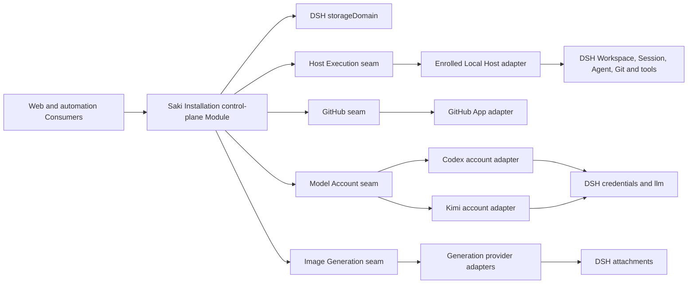

# Saki 0.1.0 后端架构

[English](0.1.0-backend.md) | 中文

本文定义 [0.1.0 版本规格](../versions/0.1.0.md)的初始后端 Module、Interface、持久化所有权和故障语义。产品含义仍由[领域上下文](../../agents/domain.md)定义；架构原因仍由 [ADR 0004](../../adr/0004-control-and-execution-planes.md)、[ADR 0005](../../adr/0005-recoverable-control-intents.md)、[ADR 0006](../../adr/0006-modular-control-plane-and-four-capability-seams.md)、[ADR 0007](../../adr/0007-single-control-plane-and-enrolled-hosts.md)、[ADR 0008](../../adr/0008-principals-grants-and-actor-attribution.md)、[ADR 0009](../../adr/0009-durable-dispatch-intervention-and-attention-projections.md)、[ADR 0010](../../adr/0010-fenced-idempotent-dispatch-admission.md)、[ADR 0011](../../adr/0011-dpapi-local-user-trust-credentials.md)、[ADR 0012](../../adr/0012-forward-migrations-and-installation-maintenance.md)、[ADR 0013](../../adr/0013-polling-first-staged-github-synchronization.md)、[ADR 0014](../../adr/0014-stable-resource-bindings-over-canonical-worktrees.md)和 [ADR 0015](../../adr/0015-reserved-automation-budgets-and-usage-ledger.md)保存。

## 运行时结构

0.1.0 中的 Saki 是一个由 Cordis plugin 组成的单进程系统。该进程运行一个稳定 Saki Installation 的唯一活动控制面，以及一个具有独立身份的已登记 Local Host。控制面与执行面在逻辑上分离，但两者之间没有网络传输。未来的远程 Host 实现 Host Execution seam，而不是把 Work Item、policy、routing 或恢复规则移出控制面。迁移 Installation 前必须让旧写入者完全停稳；不支持活动—活动控制面。



## Package 拓扑

Saki package 使用 `@breakfastdapaidang/saki-*` 命名空间，并在 0.1.0 保持 private。仓库现有 `packages/*/*` workspace pattern 已经包含 `packages/saki/*`；开始实现前，package 治理与发布检查必须显式识别第二个命名空间。通用 DPAPI 凭据 Provider 是唯一计划放入现有 DSH package group、而不是 `packages/saki/` 的新增 package。

| 路径 | Module 职责 |
| --- | --- |
| `packages/credentials/credentials-windows-dpapi` | `ctx.credentials` 的通用 Windows DPAPI Service Provider |
| `packages/saki/control-plane` | 深产品 Module：Control Intent 生命周期、记录所有权、授权、policy、恢复和 Projection |
| `packages/saki/execution` | Host Execution Service Definition |
| `packages/saki/execution-local` | 基于 DSH runtime 和系统 Git 的 Local Host Provider |
| `packages/saki/github` | 提供平台级事实与 mutation 的 GitHub Service Definition |
| `packages/saki/github-app` | GitHub App Provider，以及 polling 或 webhook 归一化 |
| `packages/saki/model-account` | Model Account Service Definition 与 provider registry |
| `packages/saki/model-account-codex` | Codex 授权、用量、capability 与 LLM route Provider |
| `packages/saki/model-account-kimi` | Kimi 授权、用量、capability 与 LLM route Provider |
| `packages/saki/generation` | Image Generation Service Definition |
| `packages/saki/generation-<provider>` | 第一个经过验证的生成 Provider；协议研究决定其具体名称 |
| `packages/saki/automation` | 评估 Automation Policy、预留资源、结算用量并提交 Control Intent 的 Consumer 与内部预算服务 |
| `packages/saki/installation-maintenance` | 产品 backup、升级、加密 export、restore、retention 与替换 Host 恢复编排 |
| `packages/saki/host-api` | 只暴露控制面 Interface 的 Host 端类型化 transport |
| `packages/saki/web-ui` | 客户端 Consumer 与 Projection 渲染 |
| `packages/saki/bundle` | Saki profile composition 与默认 plugin wiring |

控制面 package 把 `work-management`、`agent-operations`、`model-supply` 和 `recovery` 保持为私有源码 module。它们拥有不同术语和记录，但不把 repository 或 manager 暴露成公共 Interface。只有一个 context 获得独立 Consumer、部署、安全生命周期或发布节奏后，它才成为独立 package。

## 控制面 Interface

控制面 Module 通过两个 Interface 暴露产品操作与本地访问。封闭的 Intent map 和 Query map 在不导出存储表的前提下保留 payload 与 result 的类型关系，访问 Interface 则让 bootstrap 与 Browser Session 生命周期不进入产品权限体系。

```text
SakiAccess
  readAccess(presentedSession?, signal) -> AccessProjection
  exchangeBootstrap(transportContext, request, signal) -> AccessExchangeResult
  logoutCurrentSession(authentication, requestToken, signal) -> AccessLogoutResult

SakiControlPlane
  submit(authentication, intent, signal) -> IntentReceipt
  query(authentication, query, signal) -> typed Projection
  onChanged(listener) -> disposer
```

`presentedSession` 是 Host API 从 HTTP cookie 提取的不可信 credential，`transportContext` 则是可信 connection 与 Origin metadata；两者都不是浏览器 JSON 字段。`saki-host-api` 使用 package-private `SakiAccess.resolveAuthentication(presentedSession, transportContext, requestToken?)` helper，按需通过 digest、generation、lifecycle、Origin 与 request token 验证 raw cookie，并构造 `AuthenticationContext`。该 helper 只对 trusted Consumer 可用，不是 wire method，也绝不向浏览器返回认证上下文或 raw cookie material。

`submit` 从 Consumer 接收该可信认证上下文。每次调用都会重新验证活动 Installation State Generation 中的 active Browser Session、active Principal，以及当前 Grant revision 与 resource scope；随后评估 Automation Policy、派生 Actor，并在任何资源预留或外部调用前验证完整 Intent。不可信请求中的 Principal、认证上下文、Actor、Browser Session 与 Grant 权限字段会被拒绝，而不是被忽略或信任。它持久化已接受的 Intent、应用 expected-revision 检查、原子创建或复用必需预算预留与单记录准入声明，再派发外部工作。用相同内容重用一个 Intent id 时返回已有 receipt；使用不同内容重用时拒绝。

`query` 执行相同的 Browser Session、Installation generation、Principal lifecycle、当前 Grant revision 与 resource scope 验证，再返回分离的产品 Projection，例如带有控制面推导 Action Offer 的 My Work、Project summary、Development Workspace、Work Item、Milestone and Release、Work Session、Agent Run、Execution Trace、Project configuration、Model Supply、Generation Job 和 Attention Inbox。它不得返回 KV handle、可变 domain entity、活动 DSH Agent、后续调用所需的 Host 路径、凭据值或 provider 专用响应。Action Offer 反映当前 eligibility，但不授予权限；`submit` 会重新评估其 expected revision、Grant 与 operation 条件。

`SakiAccess.readAccess` 是唯一允许在没有有效 Browser Session 时读取的操作。它的未认证形式只包含封闭的必需操作状态和通用重试说明；不会包含 Installation、challenge、Principal、Grant、Host、Project 或 resource identifier，也不会区分未知、过期、已消费或已撤销 secret。认证形式包含展示安全的 Principal 与 Browser Session 事实，以及从请求呈现的 raw session cookie 派生的 request token，但绝不包含 cookie material、verifier secret 或 Grant 记录。`exchangeBootstrap` 与 `logoutCurrentSession` 是仅有的两个不经过 Control Intent 的产品 mutation：它们只按认证协议修改 Installation Access aggregate，无法触及 Project、Host、provider 或外部副作用状态。

Milestone and Release 把 GitHub Milestone scope 与版本化 Saki phase、准确 `saki-v*` tag、递归 peel 后 Release Commit、纳入的官方 Upstream Baseline、内嵌 Release Evidence、PR 与 CI evidence、observation state，以及 repair 或 reconciliation state 投影到一起。Execution Trace 返回已有 Actor、Intent、Dispatch、Host Operation、Execution、Session、Run、Intervention、usage 与 Outcome Evidence 记录之间的有界 reference，不会创建另一套 event log。Project configuration 为一个已选择 Project 组合当前 binding 与 GitHub mapping revision、默认 Agent Profile、Automation Policy、类型化预算、automatic-Done evidence rule、同步 policy、有效 validation 和 repair state。

Project configuration Intent 携带 expected configuration revision，并且只更新默认 Agent Profile、Automation Policy、类型化预算、automatic-Done evidence rule 或同步 policy。控制面验证引用的 Agent Profile 存在、每项已启用自动 action 都处于 Project Automation Principal 的 Grant 范围内、必需类型化预算是有限值、automatic-Done rule 指向受支持 Outcome Evidence，而且同步变更具有有效 GitHub mapping。Resource Binding 与 GitHub mapping 在这里保持只读 reference，只能通过专属登记、rebind 或 mapping-repair Intent 修改。同步变更只有在重新验证和完整扫描发布新 checkpoint 后才可用于 mutation；只保存配置绝不证明 automation 已激活。

`onChanged` 是封闭的 post-commit 失效通知。listener 接收受影响的 Projection key 并重新查询；它不折叠 delta、不授权工作，也不把通知送达当作持久证据。Principal lifecycle 或 Grant revision 与 scope 变化时，所有受影响的 Principal scope Projection 都必须在下一次读取前失效。

### 持久化所有权

| 记录 | Saki 权威事实 |
| --- | --- |
| Saki Installation | 稳定 Installation identity、产品命名空间、活动写入模式、活动 Installation State Generation、数据格式 revision 与兼容 build identity |
| Saki Host | 稳定 Host identity、登记与信任状态、可重新验证的 capability inventory 和最近观测 |
| Installation Access | 单一 aggregate owner record，内部包含不同的 branded、revisioned Bootstrap Challenge 与 Browser Session entry；generation 与 Principal binding；单向 bootstrap 与 cookie-token digest；非秘密 request-token derivation version 与 domain metadata；签发和过期时间；单调 lifecycle state；以及 cleanup metadata |
| Principal | 稳定安全身份、kind、生命周期和外部 identity binding |
| Grant | 签发者、目标 Principal、允许操作、资源范围、有效期、委派限制、父 Grant、revision 与撤销 |
| Development Project | 稳定身份、DSH Workspace 与 Resource Binding 引用、GitHub binding、默认值和配置 revision |
| Resource Binding | 稳定绑定身份、所属 Host、带 revision 的 Workspace 与 worktree 观察、健康状态、rebind 证据和退役状态 |
| Work Item control | GitHub 引用与观测 revision、Work Assignment、Work Session 关系、primary Session 和 claim 来源 |
| Work Session | 稳定协作身份、Work Item 关联、DSH Session 关联、participant 与主历史事实 |
| Agent Run | 生命周期、trigger、实际 Agent Profile version、已解析 Model Route、Host Operation 引用、evidence 与 outcome |
| Automation Policy | 版本化 admission、delivery、evidence、budget 和 automatic-Done 规则 |
| Automation Budget Reservation | Policy revision、Actor、Intent 或 operation、scope、预留维度、过期时间、生命周期和结算 reference |
| Usage Ledger Entry | 带归因的已测、估算、修正、释放或未解决用量，以及 evidence 来源与观察时间 |
| Control Intent | 不可变 Actor 与 Grant revision、请求动作、幂等身份、生命周期阶段、外部引用、error 与 reconciliation 状态 |
| Execution Dispatch | 目标 Execution 与 Host、Work Session 与 Profile reference、payload digest、交付状态、claim id、执行器、过期时间、revision 与 fencing token、attempt 元数据、已接受 operation reference 和 reconciliation 状态 |
| Host Operation | Host 拥有的 dispatch 幂等映射、不可变 input digest、目标 Execution、已接受 fencing token、operation 生命周期、inspection 状态和 cancellation outcome |
| Execution Lease | Resource Binding holder、拟创建 Run 与 Intent、获取 revision 和释放状态 |
| Intervention Request | kind、subject、target、所需回答、阻塞范围、因果 reference、deadline 与 escalation policy、revision 和解决结果 |
| Provider Account Profile | provider 身份、credential 引用、Credential Protection Level 观测、账号元数据、激活状态和最新 Usage Snapshot |
| Context Policy | 版本化 measurement、compaction、pruning、restoration 与 observability 配置 |
| Generation Job | route、prompt 与 input 引用、queue 状态、provider attempt、output、provenance 与 cancellation |
| GitHub Sync Checkpoint | Installation、Project、Repository 与 mapping revision、完整扫描 generation 和时间、已确认远端指纹、mapping health，以及 rate-limit 或失败观察 |
| Milestone Delivery | GitHub Milestone identity、metadata revision、Saki 拥有的 delivery phase、预期 release tag、repair 或 reconciliation state，以及可选不可变 Release Evidence；该 evidence 包含准确 tag 与 Release identity、递归 peel 得到的 Release Commit、准确官方 Upstream Baseline、祖先关系验证、PR 与 CI evidence、Actor，以及完成发布的 Intent |

GitHub 拥有 Work Item Status 与手动排序；本地 Git 拥有 repository state；DSH Session event 拥有模型可见历史。Saki 记录引用、观测和恢复元数据，不成为这些事实的第二个权威来源。

### 恢复顺序

启动时先打开并验证 Saki domain，再允许自动化工作。系统先确认 Installation identity 与已登记 Local Host、只 reconcile 按服务端时钟已经过期的 Bootstrap Challenge 与 Browser Session entry、拒绝来自其他 Installation State Generation 或 inactive Principal 的 session、重新验证 Host capability inventory 与 Resource Binding、加载当前 Grant revision，再描述每项受管理凭据，并只激活有效保护满足 policy 的 Provider Account Profile，然后依次检查非终态外部 operation、对账非终态 Control Intent 与 Execution Dispatch、验证占用中的 Execution Lease、恢复未结算预算预留、恢复开放 Intervention Request、完成必需 GitHub 扫描，最后才接收自动工作。重启绝不会缩短本来仍 active 的 Browser Session。存在可恢复项目时仍允许手动读取，但写入所有权不确定的 binding、未知外部消费或无效 GitHub mapping 会使受影响的自动 operation 保持不可用。

任何外部调用都不得在 `storageDomain` update callback 中运行。每条强准入不变量只能有一个拥有记录；其他记录通过 Intent 生命周期收敛。Project 级进程内串行可以减少争用，但不构成持久化锁或多进程锁。

## 数据演进与 Installation 维护

Saki 控制面 domain 通过 `storageDomain` 使用专用 SQLite backend 与数据库；无关 DSH domain 不共享它的 generation 生命周期。Saki 自有持久 schema 登记连续、确定性的 `N -> N+1` migration，并校验历史输入与输出。通用 migration runner 属于 `storage-domain`，不进行外部调用，也不发送活动 domain change event；没有完整 chain 的 domain 保留现有版本不匹配快速失败。磁盘版本高于当前 build 或请求向下迁移时会拒绝。

一个 Installation manifest 选择唯一活动且可写的 Installation State Generation。升级会拒绝新 mutation、禁用自动化、排空写入、关闭活动 domain、创建并验证精确 Recovery Backup、迁移全新 candidate 数据库、使用当前 spec 重新打开、校验产品 invariant，最后原子切换 manifest。启动按 manifest 选择，不按文件名或较新时间戳。发布前崩溃时旧 generation 保持活动；发布后崩溃时重新打开新 generation。选中 generation 无效时进入维护恢复，不隐式选择其他副本。

`saki-installation-maintenance` 拥有 `backup`、`verify`、`upgrade`、加密 `export`、`restore` 与 retention 编排。Recovery Backup 与兼容 build 配对，用于本地回滚。Installation Export 通过拥有 Session export capability 包含 allowlist 中的 Saki 记录、完整性元数据与关联 DSH Session export。它排除明文凭据、DPAPI 密文、cache、活动 process 状态、worktree 内容，以及作为可复用权限的绝对路径。

替换 restore 会在不覆盖运行中 Installation 的情况下构建 candidate，保留 Installation id 并创建新 Host id。它把 Resource Binding 标为 `needs-rebind`，在重新授权或导入私钥材料前禁用 Host 绑定 Provider Account Profile，要求未解决 Host Operation 与 Execution Dispatch 进入对账，并在恢复期间保持自动化禁用。源 Host 必须保持退役或离线；0.1.0 没有能够 fence 两个被故意启动的历史副本的外部 coordinator。0.1.0 通过 PowerShell 7 与 CLI 暴露维护能力，Web UI 暂缓。详细实现与 crash matrix 位于 [migration 与维护 Agent Note](../../../.agents/notes/proposed/architecture/2026-08-18-saki-forward-migrations-and-installation-maintenance.md)。

## 持久派发与介入

已接受 Control Intent 创建或恢复 Execution 时，系统先持久化 Execution Dispatch。Host wake-up 是一次性 delivery 机制：启动恢复或未来 transport 可以再次提交同一 dispatch。Dispatch 记录拥有目标 Execution 与交付状态，Intent 则拥有授权、归因与请求的产品变更。

### Dispatch 生命周期

| 状态 | 含义 |
| --- | --- |
| `pending` | 尚未接受 Host Operation；记录在 `nextAttemptAt` 到达后可被领取。 |
| `claimed` | 一条未过期 Dispatch Claim 可以准备 Host admission。 |
| `accepted` | Host Operation 映射和控制面 receipt 已经持久化；交付完成，但 Execution 未必完成。 |
| `canceled` | Control Intent 在 acceptance 前取消交付。 |
| `rejected` | Host 明确拒绝 admission；修正需要新的 Intent 和 dispatch。 |
| `reconciliation_required` | 因为无法证明结果、absence 或剩余重试权限，自动交付已经停止。 |

`accepted`、`canceled` 与 `rejected` 是交付终态。只有在已记录 evidence 使另一次尝试安全时，带归因的 reconciliation Intent 才能把 `reconciliation_required` 解决为上述状态之一或 `pending`。

### Claim 与 Host admission

持久 scanner 使用 expected-revision compare-and-set 领取符合条件的 `pending` dispatch，或者替换已过期 `claimed` 记录。新 claim 记录执行器、claim id、签发与过期时间，递增单调 fencing token，并把状态改为或保持为 `claimed`。同一执行器可以使用 expected revision 续期未过期 claim，并保持 token 不变；过期 claim 只能用更高 token 重新领取。Claim 时间与有效性由控制面决定。

Claimant 使用稳定 dispatch id、目标 Execution、不可变 payload digest 与当前 claim 调用 `prepareDispatch`。Host 向控制面验证该 claim，并在调用 DSH 或其他外部能力前，以 dispatch id 为键原子创建或返回一条 Host Operation。完全相同的重复请求或后续有效 claim 会返回同一 reference，并记录最新 prepared token；不可变 input 改变会产生 conflict。随后，控制面针对仍为当前的 claim 执行 compare-and-set，重新验证 cancellation、Grant、Automation Policy、Host capability 与所有必需 Execution Lease，持久化 operation reference，并把 dispatch 改为 `accepted`。

只有 `startOperation` 可以启动或恢复已准备 Host Operation，而且它会先验证已接受 dispatch、operation reference、fencing token、当前 cancellation state 与 capability-boundary authority。Start 按 operation reference 保持幂等。Acceptance 失败的 preparation 会保持 inert。Claim 过期会使旧 claimant 失效，但不会取消已接受 operation、停止其 Execution 或释放其 Execution Lease。完整原因与故障顺序见 [ADR 0010](../../adr/0010-fenced-idempotent-dispatch-admission.md)。

持久 `attemptCount`、`nextAttemptAt` 与 `lastError` 驱动可配置 retry backoff；进程本地 notification 只负责唤醒 scanner。Host preparation 前确认的瞬态失败可以释放 claim，并让同一 dispatch 回到 `pending`。任何 acknowledgement 缺失后，恢复流程都会先按 dispatch id 检查再重试。确认不存在后可以在过期后重新领取；结果不明、证据冲突或 retry budget 耗尽会停止在 `reconciliation_required`，并在需要操作者决定时创建 Intervention Request。Acceptance 前取消会把 dispatch 改为 `canceled`；acceptance 后取消会保留 `accepted`，并通过另一条 Intent 控制 Host Operation 或 Execution。

### Intervention 与待处理事项

Intervention Request 独立于实时 Agent turn 持久保存输入、审批、凭据授权、验收、冲突解决或对账工作。回答通过新的 Control Intent 提交，并且必须针对 request 的 expected revision。第一个有效授权回答胜出；通知确认保持独立，过期绝不产生批准。模型可见回答作为带归因、可重建的 event 或持久 reference 进入 Work Session。

Attention Inbox 面向已认证 Principal，投影开放 Work Assignment、Intervention Request、失败或结果不明的 Dispatch 与选定 Signal。它不拥有队列行。Work Management `Inbox` 仍表示未评估 Work Item 的 status，不是该 Projection。

## 共享的外部副作用规则

四个 capability seam 不实现统一 adapter 基类。它们共享以下义务，同时保留各自特有的方法：

- 每个 mutation 都携带 Control Intent id，以及当前 attempt 必需的 cancellation signal。
- 每次 dispatch 都携带不可变 Actor 归因和该 operation 需要的最小委派权限；外部凭据身份与 Saki Actor 分开记录。
- Host preparation 必须在控制面接受交付且 Host 开始外部副作用前，返回稳定的 operation 或自然资源引用。
- 再次 dispatch 要么幂等，要么在 inspection 确认前一次结果前被禁止。
- inspection 区分 pending、succeeded、failed、canceled 和 unknown outcome；unknown 不代表 failed。
- Provider notification 只是提示系统 inspect 或 refresh。只有确认过的 read 或 mutation result 才更新权威 Projection。
- error 使用 provider-neutral 类别表达 invalid input、conflict、denial、unavailable dependency、rate limiting、unsupported capability、cancellation 和 unknown outcome，同时保留 provider evidence。
- adapter 每次操作时通过目标 Host 上的 capability Provider 解析 credential reference 与有效 Credential Protection Level，强制该 operation 所需等级，并且绝不返回 secret value。控制面记录只保留不透明 reference 和安全观测。

## Host Execution seam

Host Execution 隔离机器本地资源，也是未来远程 Host 的 seam。每个 Resource Binding 标明其所属 Host，控制面通过该 binding 寻址，不把隐式本机或全局绝对路径当作身份。Local Host adapter 在内部解析 DSH Workspace 路径、Agent 与 Session handle、filesystem、tool 和系统 Git。

```text
HostExecution
  inspectProject(binding, selection, signal) -> HostProjectSnapshot
  readDiff(binding, request, signal) -> DiffPage
  prepareDispatch(request, claim, signal) -> HostOperationReceipt
  startOperation(operation, acceptance, signal) -> HostOperationSnapshot
  inspectOperation(operation, signal) -> HostOperationSnapshot
  cancelOperation(operation, reason, signal) -> HostOperationSnapshot
  onChanged(listener) -> disposer
```

初始 dispatch union 包含 `StartAgentRun`、`StageFiles`、`UnstageFiles`、`Commit`、`Push` 和 `MaterializeArtifact`。`prepareDispatch` 持久化幂等映射，但不执行 union member；`startOperation` 只在控制面 acceptance 后执行。`StartAgentRun` 指定 Execution Dispatch 与当前 Dispatch Claim、Agent Run、Work Session、Agent Profile version、Model Route reference、limit、Actor 归因、委派 Grant reference 和 create-or-resume Session disposition；它不携带原始工作目录或 token。一次性 Run 没有独立 Principal，只接收父级子集授权。`MaterializeArtifact` 在明确的 absent-or-expected-hash precondition 下，把经过验证的 Attachment reference 复制到 Project 相对路径。

Git mutation 使用结构化请求，而不是任意命令字符串。Commit 指定 expected index tree，Push 指定 expected commit 与 target ref，因此 inspection 能判断一次确认丢失的操作是否已达到目标状态。取消 Agent 时，只有 DSH Agent handle 进入 quiescence 后才结束 Host Operation；终端进程被终止不等于可恢复 Session 已结束。

`HostProjectSnapshot` 报告 binding health、展示位置、worktree identity、branch、HEAD、upstream、staged 与 unstaged summary，以及无法归因的修改。diff 内容单独分页并设限，Project summary 不得加载 repository 规模的文本。

### Resource Binding 生命周期

Resource Binding id 稳定并拥有 Execution Lease 排他性；其位置是带 revision 的 Host 观察。登记只接受已有目录。Local Host 把 DSH 的 `fs.realpath` Workspace 规范与 Git 的绝对 top level、每 worktree Git directory、common Git directory 和 NUL 分隔的 porcelain worktree inventory 组合起来。同 Host 候选项在规范 worktree root 或每 worktree Git directory 任一相同时冲突；common Git directory 对相关 worktree 分组但不折叠它们。路径不会被转换成小写，因为所选文件系统可能区分大小写。

绑定健康状态为 `active`、`missing`、`repair-required`、`needs-rebind` 或 `retired`。Mutation 准入重复执行 Host 检查并拒绝陈旧绑定 revision。`RebindDevelopmentProject` 要求所有可能修改旧位置的 Run、terminal、Dispatch 与 Host Operation 达到完全停稳。然后它选择已有目录，在 Host Operator Actor 下记录新旧证据，并把 Project 推进到新规范位置的 DSH Workspace。历史 DSH Session 保留原始 Workspace 与 cwd；继续 Saki Work Session 时创建后继 DSH Session，而不重写历史。

0.1.0 不实际创建、移动、repair、移除或 prune worktree。退役会禁用新执行，但不删除本地或远端资源。自动模式要求 clean worktree。手动接管已有变更会记录有界 baseline 与继承变更警告；歧义混合仍不允许自动 staging 或 completion。[ADR 0014](../../adr/0014-stable-resource-bindings-over-canonical-worktrees.md)定义完整生命周期。

## GitHub seam

GitHub seam 暴露平台事实和授权 mutation，而不拥有 Saki Board 规则。控制面负责把 GitHub field 映射为 Work Item Status、解释 Milestone 与 Outcome Evidence，并决定哪些 mutation 来自用户或 automation Intent。

```text
GitHubCapability
  read(query, signal) -> typed GitHub facts
  scan(request, signal) -> complete GitHubScan
  dispatch(mutation, signal) -> GitHubMutationReceipt
  inspectMutation(mutation, signal) -> GitHubMutationSnapshot
```

初始 read 集合覆盖 repository、Issue、Projects v2 field 与 item、Milestone、Git tag reference 与递归 peel 得到的 target、Release、Commit 与祖先关系、PR、Actions、check、commit status 和 installation permission 事实。Release evidence 使用 `refs/tags/saki-v*` reference，并递归 peel annotated tag，直至得到 Commit；GitHub Release 的 `target_commitish` 不是 release identity。Mutation 集合覆盖创建 Issue、把 Issue 加入 Project、改变 field 或 item position、关闭或重新打开 Issue，以及创建或更新 PR。Adapter 返回 GitHub node id、URL、observed revision 与 rate-limit 事实，不把它们转换为 Saki status。

`CreateWorkItem` 会在派发 GitHub 工作前持久化标题、预期结果、验收条件、Project id 与 expected Project revision，以及 expected GitHub mapping revision。Saki 先记录已确认 Issue node id，再把它加入所选 Project 并写入 Inbox。每项已确认局部事实都会出现在 Work Item Projection 中，并带有恢复操作。Issue 创建 acknowledgement 丢失时，adapter 能识别结果则进行检查；否则 Intent 进入 reconciliation required，Saki 绝不创建 browser-only 卡片，也不会盲目再创建一个 Issue。

0.1.0 使用可配置 polling 作为基线。一次扫描会分阶段读取每个必需 Project item 与 Repository Issue 页面，验证 node-id mapping，并通过一个原子已确认 Projection 推进 GitHub Sync Checkpoint。Page cursor 是扫描中的分页状态，绝不是持久变更 offset。活动 Board 默认每 30 秒轮询，后台 Project 默认每五分钟轮询；启动、手动刷新、重连、本地 mutation 和后续 webhook 会唤醒同一个扫描器。Webhook 永不直接应用状态。

Board scan 与 GitHub Sync Checkpoint 保持独立，不与 PR、CI、Milestone、tag、Release、Commit 和祖先关系的定向读取合并。只有相关 View 处于活动状态，或相关 Intent、Run、delivery、reconciliation 仍在 pending 时，这些事实才按可配置 polling 刷新。每个受影响 Projection 都携带自己的最近确认 observation、当前 failure、staleness 与 invalidation 状态；定向刷新失败时保留此前确认的事实，且绝不推进 Board checkpoint。

GitHub 拥有 Milestone 的 title、description、due date、open 或 closed state 与 Issue scope。版本化 Saki `Milestone Delivery` record 拥有 Planned、In Progress、Ready to Release 或 Canceled phase metadata，以及可选不可变 Release Evidence；phase 变更使用 expected-revision Control Intent。只有该 evidence 把预期的准确 `saki-v*` tag 与 GitHub Release 绑定到同一个递归 peel 后 Commit 时，Released 才能被派生。外部关闭的 Milestone 若既没有 Canceled metadata，也没有匹配 release evidence，就进入 repair 或 reconciliation，而不被隐式分类。

Release Intent 在 finalization 前写入准确官方 upstream Commit，作为 Upstream Baseline。带 expected revision 的 finalization Intent 从配置的 upstream repository 读取该 Commit，验证它是递归 peel 后 Release Commit 的祖先，并在同一 Milestone Delivery record 中原子嵌入不可变 Release Evidence，其中包含 tag、Release、Commit、baseline、此前 Milestone Delivery revision 与支持 evidence。Branch name 与 `target_commitish` 都不能替代任一 Commit。Finalization 期间观察到的外部 GitHub 变化会使 Intent 进入 conflict 或 reconciliation，且不会发布局部 phase 或 evidence mapping。

每个 Board mutation 都携带关于 membership、Status、Issue open state 与相关排序邻居的预期远端指纹。定向预读取允许幂等成功或执行 mutation；任何不匹配都是可见 conflict。Adapter 在 mutation 后确认目标，并在重试前检查丢失 acknowledgement。Field 被重建或缺失会使写入不可用，直到带归因的修复 Intent 和完整扫描成功。每个 installation-token 使用一条串行队列，优先处理交互与 mutation 工作，观察 GraphQL 和 REST limit，并在耗尽可配置保留量前暂停后台扫描。[ADR 0013](../../adr/0013-polling-first-staged-github-synchronization.md)定义发布、conflict、修复和 rate-limit 行为。

## 自动化预算

自动模式使用持久预留，而不是客户端 counter 或 Run 后估算。控制面会在对应 effect 前，预留所有适用的每 operation、Run、Work Item、Project window 与 Provider Account Profile 维度。预留以幂等方式按 Control Intent 或 Host Operation 确定键。实际用量、释放、修正与未解决金额会追加带归因的 Usage Ledger Entry；响应缺失时继续保留预留，直到 inspection 证明用量或不存在。

每个启用的 0.1.0 自动 policy 都会为并发 Agent Run、Run wall time、模型请求、input token、output-token allowance、并发与总 Generation Job、generation attempt、GitHub mutation、push 和由 Saki 引发的 CI trigger 设置有限 limit。提供方报告单位或货币、allowance window 与观察到的 GitHub Actions 时长仍是可选类型化维度。Actions 分钟可以在观察后暂停后续工作，而 push 与 dispatch 计数会在最终账单可知前限制 Saki 自身的 trigger attempt。

每条 route 选择 `pause-on-unknown` 或 `local-limits-only`。Local-only 准入要求每个本地硬 limit 都存在，并且没有观察到耗尽或拒绝；审计会把提供方全局 quota 或货币成本保留为未知。Limit 耗尽会阻止新自动 effect，在安全边界请求 deadline cancellation，并创建 Intervention Request。它绝不意味着 Done。Host Operator 可以通过新 Intent 授权精确、会过期的一次性例外，但不会扩张底层 Grant。[ADR 0015](../../adr/0015-reserved-automation-budgets-and-usage-ledger.md)定义预留与结算语义。

## Model Account seam

Model Account Provider 在现有 DSH LLM seam 上归一化订阅授权、账号检查、Usage Snapshot 和账号专用 route 激活。Saki Model Supply module 选择 Provider Account Profile 与 Model Route；Provider package 不实现自动账号选择。

```text
ModelAccountProvider
  beginAuthorization(request, signal) -> AuthorizationChallenge
  continueAuthorization(authorization, signal) -> AuthorizationProgress
  inspectProfile(profile, signal) -> ModelAccountSnapshot
  activateProfile(profile, signal) -> ActivatedModelAccount
  revokeProfile(request, signal) -> RevocationResult
```

Authorization challenge 把 device-code 与 browser callback flow 归一化为 expiry、next-poll time、verification URI 和可选 user code。完成授权时通过 `ctx.credentials` 存储 token，验证有效解析结果满足所需 Credential Protection Level，并只返回 credential reference 与 provider account identity；不得把 token 返回控制面或 Web client。取消操作只会停止本地 polling，不宣称 provider 端 grant 已撤销。

Activation 通过 `ctx.llm.registerAdapter` 注册或原子替换不透明的账号专用 provider route。Work Session 记录选中的 route，每个 Agent Run 记录实际使用的 route。只有安全的 request boundary 才能切换账号，活动 model call 期间不得切换。

`ModelAccountSnapshot` 分开表示 authentication、health、capability、entitlement 与 usage retrieval。Usage state 为 `available`、`temporarily-unavailable` 或 `unsupported`；不能把 provider 缺失数据展示为剩余额度为零。额度耗尽时按 policy 阻止新 dispatch，但不得静默轮换到另一个 profile。

## Image Generation seam

Image Generation Provider 执行单次 provider attempt。控制面拥有持久 Generation Job、账号级 queue、concurrency、retry、attribution，以及与 Work Item 或 Work Session 的 attachment。进程内 `ctx.jobs` registry 可以镜像活动 attempt 供模型 tool 使用，但不是持久 job 权威来源。

```text
ImageGeneration
  describeRoute(route, signal) -> GenerationCapabilities
  dispatch(request, signal) -> GenerationAttemptReceipt
  inspectAttempt(attempt, signal) -> GenerationAttemptSnapshot
  cancelAttempt(attempt, reason, signal) -> GenerationAttemptSnapshot
```

Request 指定 Generation Job 与 Intent、已解析 Model Route、prompt、input Attachment reference、输出约束和 provenance context。Provider adapter 读取验证过的输入，并在返回 output reference 前通过 `ctx.attachments` 保存完成的输出字节。它不写入 Project worktree；用户可见的写入由独立 Host `MaterializeArtifact` operation 完成。

Saki Generation module 在可配置的账号级 concurrency limit 下准入 attempt。取消 queue 中的任务是即时本地操作；已派发任务的取消遵循 provider capability，如果完成先于取消生效，最终状态可以是 succeeded。没有 status lookup 的 provider 在确认丢失后可以返回 unknown，此时保持 reconciliation required，而不是自动再次产生费用。

到达或离开模型的图片 prompt、reference-image input、选中 output 与 provenance，必须在 UI 或另一个 Agent 消费前表示为可重建 Work Session event 或持久 reference。模型可调用的生图 skill 是此 seam 的 Consumer，不是后端本身。

## 复用的 DSH capability

| 需求 | 现有 DSH Interface | Saki 用法 |
| --- | --- | --- |
| Workspace 身份与规范目录 | `ctx.workspaceRegistry` | Local Host 内部解析 Resource Binding |
| 对话与模型可见历史 | `ctx.sessions` 与 persistence | 与 Work Session 关联的 DSH Session |
| 活动 Agent 生命周期 | `ctx.agents` 与 Agent Preset | 创建或恢复 Agent Run 的执行 |
| 文本与 tool-call 模型 streaming | `ctx.llm` | 已激活的账号专用 Model Route |
| 上下文管理 | `ctx.compaction` 与 token measurement | Agent composition 选择的 Context Policy Provider |
| Secret 间接引用与保护元数据 | `ctx.credentials` 与 Windows DPAPI Provider | OAuth 与 provider credential reference，以及快速失败的 `local-user-trust` policy |
| 持久图片字节 | `ctx.attachments` | 生图输入与 content-addressed output |
| 活动后台 tool 交互 | `ctx.jobs` | 可选镜像一个运行中的 generation attempt |
| 开发工作流指导 | `ctx.skills` | 固定版本的 Saki Development Skill Pack |
| 文件、shell、terminal、sandbox 与 tool | 现有 DSH seam | Agent 与 Local Host 的实现细节 |

当已有接口能表达所需行为时，Saki 不增加包装层。通用的缺失能力应先贡献给上游，或作为通用 DSH Provider 增加，再考虑创建 Saki 产品专用替代品。

## 凭据保护

`credentials-windows-dpapi` Provider 以通用 DSH package 实现现有凭据 Service Definition。它只把受管理值保存为可版本化、不透明 Host-local 文档中的 DPAPI 当前用户密文，并在 `CredentialInfo` 与 `ResolvedCredential` 中报告由 Provider 定义的 `protectionLevel`。Ambient 与明文 layer 也要报告明确等级；任何默认值都不得把 legacy 或未知来源标记为受保护。

Saki 把 Codex 与 Kimi refresh token 和 Product GitHub App private key 分类为受管理高价值 reference。授权、Profile 激活与外部副作用准入要求有效解析结果报告 `local-user-trust`；environment、`.env`、明文 `.credentials.yaml`、缺失元数据和机器范围 DPAPI 都会快速失败。只检查较早的 `describe()` 结果并不充分，因为并发来源变化可能使它与 operation 实际使用的值不一致。

原始解析保留在有特权的 Host Provider consumer 中。控制面与 Host transport 接收安全目录 View，其中包含 reference、source、保护等级、配置状态、可写性、健康和观测时间，但没有 resolve method。Agent tool、动态 execution context、Session event、Projection、log、diagnostic、crash artifact 与 wire payload 都不接收原始值或密文。该 composition rule 防止意外访问，却不会把 DPAPI 变成同用户进程隔离；`local-user-trust` 正是对这项限制的命名。

可移植 Installation export 排除 DPAPI 文档。Host 替换后，控制面保留账号关系，把 Profile 标记为不可用，并创建 Intervention Request，要求设备重新授权或仅 Host 可用的私钥材料导入。组织账号共享需要单独设计、运行于另一 OS 安全身份下的 Credential Broker 或外部 secret manager；不能把 `local-user-trust` 当作多用户边界复用。详细实现与验证义务见[凭据 Agent Note](../../../.agents/notes/implemented/architecture/2026-08-18-saki-local-user-trust-dpapi-credentials.md)。

## Host transport 与 Web 访问

`saki-host-api` 通过现有类型化 Host transport 暴露三个公共 `SakiAccess` 操作与三个 `SakiControlPlane` 操作。每次受保护 query、submission 或 logout 前，它从 HTTP transport state 取得 raw cookie，只通过 SakiAccess 的 trusted-Consumer helper 完成解析，再显式传递得到的 `AuthenticationContext`；该 helper 与认证上下文都不在 wire 上暴露。Logout 会验证 active session 与 request token，但不查询 Grant 权限。Host API 转换其他 wire identity，并在调用任一 Interface 前验证不可信 payload。浏览器读取 Access 或受保护 Projection、执行有限的 bootstrap 与 logout 操作，并只提交产品 Intent。Provider Interface、存储表、本地文件访问与 credential 永远不成为 wire method。

0.1.0 默认把 Web surface 绑定到 loopback，并使用本地 bootstrap 交换和后续由服务端拥有的 Browser Session。该 transport 适合由运行 Saki 的同一台机器上的一个 Host Operator 使用，不必引入持久密码 verifier、不要求在本地恢复前使用 GitHub 或其他网络身份，也不会把持久 bearer token 放入浏览器存储。可撤销的服务端 session 还能跨普通进程重启存在，而不会让持有 cookie 等同于持有 Grant。该选择不构成远程访问或多用户认证设计。

Installation 初始化时配置一个本地 human Principal 与其 Host Operator Grant，然后在单一 Installation Access aggregate 中为该 Principal 添加短期 Bootstrap Challenge entry。Challenge 与 Browser Session id 是不同的 branded value，每个 entry 与 aggregate 都携带 revision。Launcher 通过本地 handoff 接收一次高熵明文 secret。交换只接受来自准确配置 loopback origin 的 POST body secret，并以不暴露失败类别的方式检查活动 Installation generation、active intended Principal、服务端时钟过期时间、digest 与 `issued` 状态。一次 expected-revision `storageDomain` record update 原子地把 challenge 从 `issued` 变为终态 `consumed`，并插入恰好一个 `active` Browser Session entry；transport 只能在该 commit 完成后发出 `Set-Cookie`。

交换响应丢失不能证明 cookie 是否到达浏览器。Challenge 保持 consumed 且不可重放，已 commit 的 Browser Session 则保持 active，直至正常过期或明确撤销；重试不得推断 cookie delivery，也不得创建第二个 session。Challenge 的 `consumed`、`expired` 与 `revoked` 状态，以及 Browser Session 的 `expired` 与 `revoked` 状态，按服务端时钟保持终态且单调。Cleanup 只能在配置的安全保留期后移除 retained terminal entry，而且绝不让 id、digest 或 secret 可复用。Installation generation 替换会终止旧 generation entry；Principal 退役会在 cleanup 前使其 session inactive。重启只 reconcile 已经过记录 expiry 的 entry。

Browser Session entry 只保存不透明 cookie-token digest，而不保存明文 token。它的 cookie 使用 HttpOnly、SameSite=Strict、application path scope，并在配置 origin 使用 TLS 时使用 Secure。该记录只在所属 Installation 与活动 Installation State Generation 中跨重启有效，并在过期、明确登出、管理员撤销、Principal 退役或 generation 替换时结束。Aggregate 只持久化非秘密 request-token derivation version 与 domain。对于已认证 Access 与每个已认证且改变状态的请求，服务端先 hash 浏览器呈现的 raw cookie，并与已存 digest 做 constant-time compare，再使用所选加密 HMAC 或 KDF，通过 domain separation 从同一个 raw cookie 派生 request token。Access 返回派生 token；每个 mutation 都要求准确配置的 Origin，并把 header token 与新派生值做 constant-time compare。Bootstrap exchange 要求同一个准确 Origin，但不存在预先建立的 session token。SameSite 只提供纵深防御。

明文 bootstrap secret 只能出现在 launcher handoff 与准确的 exchange POST body 中，raw cookie 只能出现在 `Set-Cookie` 与 Cookie header 和浏览器 HttpOnly jar 中，派生 request token 只能出现在已认证 Access 与请求防伪 header 中。除这些具名 transport 外，三者都绝不进入持久存储、URL、analytics、log、diagnostic、trace、Session 或 domain event、Control Intent 或 access receipt、snapshot、无关 wire payload 或 Projection、error text、crash artifact、adapter error 或 Installation Export。系统不存在独立请求防伪 verifier secret，也不会持久化这种 secret。持久存储只包含 bootstrap 与 cookie-token digest，以及非秘密 derivation version 与 domain metadata，因此服务端可在重启后根据请求呈现的 raw cookie 重新计算 token。Failure response 不区分未知、过期、已消费、已撤销、错误 generation 或错误 Principal 的 challenge。

浏览器是 Installation 的 client，不是已登记 Host 或权限来源。对于每次受保护的 `query` 与 `submit`，transport 都解析活动 Installation generation 中的 active Browser Session 并传递可信认证上下文；控制面随后验证 Principal lifecycle 以及当前 Grant revision 与 scope。不可信 Intent wire type 不包含 Principal、认证上下文、Actor、Browser Session 或 Grant 权限字段，decoder 会拒绝保留字段，而不是忽略它们。控制面为每个已接受 Intent 派生 Actor；cookie、bootstrap secret、Access Projection 或 client 提供的声明都不能产生权限。Principal 或 Grant 变化会立即使受影响 Projection 失效。后续 GitHub 登录把外部 identity 关联到 human Principal；组织成员身份仍只是 Grant 管理的输入，不是直接 Host authority。多用户 session 管理、远程 Host 认证、非 loopback 部署和离线 delegation 不在该版本范围内。

安装进 Host 进程的 Cordis 与 npm plugin 是有特权的可信代码，因为 Cordis 生命周期隔离不是进程沙箱。模型动态生成的 plugin 只能停留在一次性 Execution 范围，除非 Host Operator 审查并安装它。仓库内容、模型输出、浏览器 payload 和外部事件仍是不可信输入，即使由可信 plugin 处理，也必须经过验证与 policy 边界。

## 验证

- 每个真实 adapter 与可控制 fake 都通过同一个 Service Definition 运行 contract suite。
- 控制面测试只在四个 capability seam 使用 fake，并通过 `submit`、`query` 和 `onChanged` 操作记录。
- 崩溃注入在 dispatch 持久化、claim、Host preparation、控制面 acceptance、operation start、Intervention Request 与 Lease 转换后停止，重新打开持久状态，并验证恢复过程通过同一 Host Operation 确定继续，不会重复外部副作用或 Agent Run。
- Dispatch 协议测试拒绝陈旧 claim、改变 replay payload、acceptance 前 start、acceptance 前 cancellation 竞态与迟到 receipt；结果不明保持 reconciliation required。
- 交互测试让 Intervention Request 跨 Web 重连与进程重启保持可回答，拒绝陈旧或未授权回答，并通过 Work Session 重建模型可见回答。
- GitHub 测试覆盖完整多页发布、移除、不完整扫描、mapping 重建、陈旧乐观移动、mutation 回复丢失、rate-limit 保留量、重启，以及只唤醒而不直接应用状态的 webhook。
- Resource Binding 测试覆盖 Windows 路径别名、symlink 与 junction、linked 与 detached worktree、缺失与移动目录、rebind 完全停稳、陈旧 binding revision、dirty takeover、退役和历史 Session 保留。
- 自动化测试覆盖竞争预留、重放、部分结算、deadline cancellation、陈旧或缺失 Usage Snapshot、歧义外部用量、CI-trigger limit、一次性例外，以及证据驱动的 automatic Done。
- 产品级 Web 测试启动真实 Saki bundle、Host transport、控制面、Local Host adapter、临时 Git repository 和可控制的外部 Provider。
- 真实 provider smoke 验证 Codex 与 Kimi device authorization、可用时的 usage attribution、一次文本 Agent Run、生图与编辑、artifact 持久化和有限并发。
- Windows 凭据测试验证静态数据采用当前用户 DPAPI 密文、保护元数据明确、来源 policy 快速失败、Host 替换要求重新授权，而且任何产品或 Agent 界面都不含明文或密文。
- Migration contract test 覆盖每个保留源版本、chain 缺口、校验失败、较新磁盘版本与向下迁移拒绝。维护 crash injection 包围 backup 验证、candidate materialization、invariant 校验与 manifest 发布；export 与 restore 测试证明认证加密、声明排除项、Session 包含、替换 Host 恢复状态，以及恰好一个选中 generation。
- 安全测试证明每种认证材料只出现在具名 handoff、cookie 或 request-token transport 中，并且不出现在持久记录、receipt、无关 Projection 与 wire payload、event、snapshot、URL、analytics、log、diagnostic、trace、error text、crash artifact、adapter error 或 export 中；未认证 Access 读取不暴露 Installation 或安全 object identifier；client 提供 Principal、认证上下文、Actor 或 Grant 字段时会被拒绝；bootstrap secret 只保存 digest、会过期且最多创建一个 Browser Session；cookie digest 认证与 request-token 派生能跨重启工作，而无需持久化 raw cookie、request token 或 verifier secret；origin、撤销、generation 与 logout 规则成立；撤销 Grant 会拒绝新副作用，同时仍可对账。

## 重新考虑条件

只有测量证明专用 `storageDomain` SQLite 路由及其 domain 与 migration facility 无法满足查询、transaction 或多进程需要时，才引入其他存储系统。只有审计或时间查询需求无法由生命周期记录与外部 evidence 满足时，才增加 append-only 控制面 journal。只有私有 context module 获得独立 Consumer 或生命周期时，才拆成 package。只有第二个 Host 成为真实部署目标，并且已经明确 trust 与 offline-execution model 时，控制面与执行面才成为网络服务。
