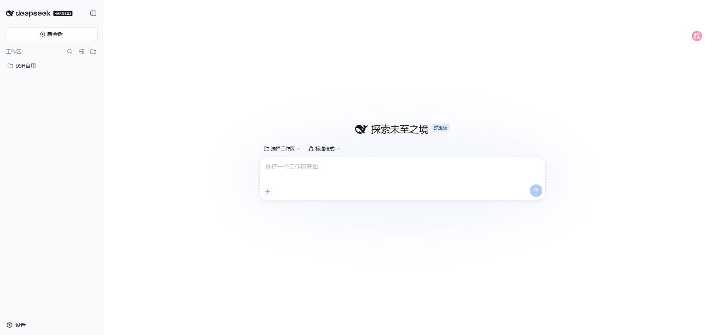
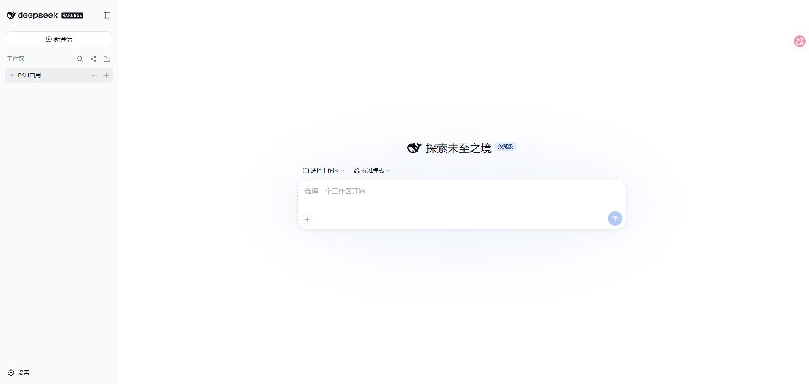
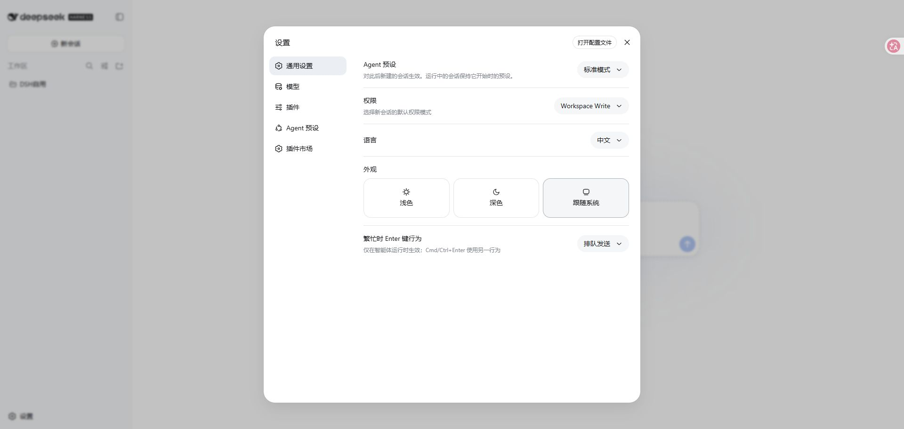
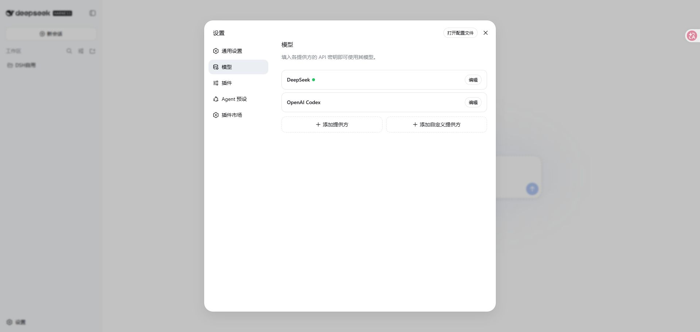
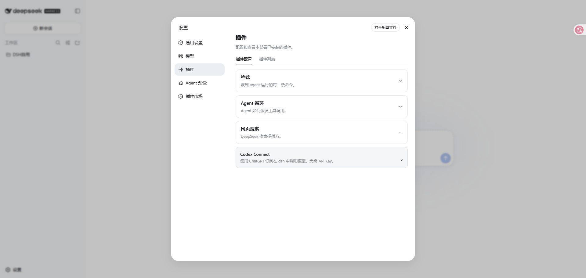
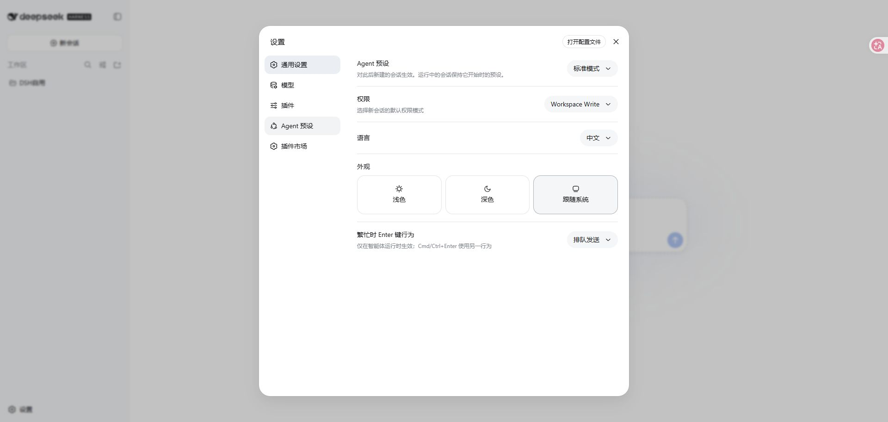

# Saki 0.1.0 Web UI integration baseline

English | [中文](0.1.0-web-ui-baseline.zh.md)

This reference fixes the scope of Saki's version 0.1.0 Web changes against the DSH Web profile. The screenshots record the composition Saki preserves; they are not visual acceptance tests or a style specification. DSH continues to own the shell's appearance.

## Preserve the DSH shell

Saki retains the shipped three-column AppFrame, collapsible sidebar, conversation surface, optional details column, settings dialog, theme system, locale system, and session navigation. It does not replace the `root`, `sidebar`, or `conversation` occupants and does not create a parallel component registry.

| DSH area | Preserved behavior | Saki addition |
| --- | --- | --- |
| AppFrame | Sidebar, main column, optional details column, resizing and responsive concession | One additive main-surface dispatch point; Conversation remains its fallback |
| Sidebar | Brand, New Session, Workspace and Session browser, collapse behavior, Settings | Two primary entries: Work with an Attention count, and Project |
| Conversation | Hero, composer, transcript, view tabs, tool presentation and pending interactions | Project and Work Item return links on associated Sessions; an optional Run evidence view |
| Settings | Dialog shell, General, Models, Plugins, Agent Presets and Marketplace | One Saki-owned Model Supply section; existing sections retain their responsibilities |
| Theme and locale | DSH tokens, appearance selection and translated chrome | Saki consumes the same facilities |

## Two added top-level pages

Version 0.1.0 adds exactly two Saki entries to the DSH shell. Conversation, New Session and Settings remain inherited DSH surfaces and do not count as Saki pages. A Saki page may open one contextual drawer, but Board, Agent Runs, Git changes, model capacity, Attention and Terminal do not remain visible at the same time.

| Page | Complexity and reader | Main job | Internal destinations |
| --- | --- | --- | --- |
| Work | Simple; a beginner, occasional contributor, or an operator who wants a quiet view | See relevant work across authorized Projects, submit a request, hand ready work to an Agent, answer a question and accept a result | Plain-language groups for ready to start, in progress, waiting for the user and completed; each item has one next action |
| Project | Complex; a developer, reviewer or Host Operator working in one selected Development Project | Plan, develop, observe, review and deliver the selected Project without losing its execution history | Board, Milestones, Changes, Sessions & Runs, Trace and Project Settings |

Changes, Sessions & Runs, Trace and Project Settings are sections of Project, not global pages. Only the active section occupies the main content area. Cross-Project Attention appears in Work in plain language; installation-wide Model Supply remains a Settings section. A future section becomes a top-level page only after it needs an independent audience, navigation lifecycle or cross-Project scope that cannot be expressed through Work or Project.

## Beginner-operable My Work

My Work is a presentation scope, not a weaker source of truth or a new permission class. It consumes the same authorized Projections and submits the same typed Intents as expert pages.

The default page shows only work relevant to the current Principal, grouped as ready to start, active, waiting for you, and recently finished. These are presentation groups rather than Work Item Status values. Each card names the Project, plain-language task, current actor, last confirmed time, and the recommended Action Offer supplied by the My Work Projection. The primary actions include Submit request, Hand to Agent, Answer, Review, and Open. Automatic mode replaces Hand to Agent with an attributed “Agent is working” state. Work awaiting acceptance stays in waiting for you; a Done or Canceled item never shows Review or acceptance.

Canonical GitHub Project status remains visible in details. Branch, worktree, commit, Provider Account Profile, model route, budget reservation and synchronization evidence appear only after the user opens technical details or follows a recovery action. Hiding those facts never permits an operation the Principal lacks authority to perform.

Version 0.1.0 can expose My Work to the Host Operator before organization accounts exist. A later Principal preference may make it the default landing page without changing its Projection or Intent semantics.

## Small changes to existing surfaces

### Start and navigation

New Session and the existing Workspace picker remain intact. Saki adds Work and Project actions below New Session. Activating either replaces only the main surface and leaves the sidebar and Settings available. Returning to a Session restores its draft, selected view and details state according to the existing client stores.

Work opens My Work and carries one textual Attention count. Project restores the last selected Development Project and internal section; when no Project is selected, it opens the Project selector. Board, Milestones, Changes, Sessions & Runs, Trace and Project Settings remain internal Project navigation rather than global sidebar entries.

### General and model settings

General settings remain unchanged. Saki does not add Project, GitHub, automation or organization controls to this page.

The existing Models page continues to configure basic provider connections. Saki registers a separate Model Supply section for account pools, authorization health, observed usage, routing, context policy and generation capacity. A link between the two pages may orient the operator, but neither page duplicates the other's fields.

### Plugins and Agent Presets

Plugins, Marketplace and Agent Presets keep their current navigation and card structures. Saki appears as installed plugin configuration where appropriate. A Project Agent Profile references an Agent Preset; it does not fork or replace the preset editor.

### Additive shell interfaces

The DSH shell needs two generic additions before a Saki plugin can provide independent pages without replacing the shell:

- `main.surface` is a root-scoped chain slot rendered in the AppFrame main column. Its fallback renders the existing `conversation` slot. A selected Saki address activates the Saki entry; DSH packages do not import Saki types.
- `sidebar.primary.action` is a root-scoped list slot below New Session and above the Workspace browser. Saki contributes the Work and Project entries; the sidebar continues to own their geometry and collapsed presentation.

`packages/saki/web-ui` owns Saki page selection and `SakiViewAddress` persistence behind its own small navigation interface. It uses the existing `conversation.session.header.actions`, `conversation.view`, `settings.section` and `shell.overlay` slots for session context, Run evidence, Model Supply settings and transient global notices. `shell.overlay` never hosts a full Saki page.

## Version 0.1.0 exclusions

Version 0.1.0 does not add a third Saki top-level page, redesign the inherited Conversation home, replace the DSH sidebar, embed an IDE, require a permanent operator cockpit, or merge provider configuration with daily work. The first implementation proves navigation between Work, Project and inherited DSH surfaces, beginner completion of a work cycle, preservation of Session and Project state, and the two additive shell interfaces before visual redesign expands.
